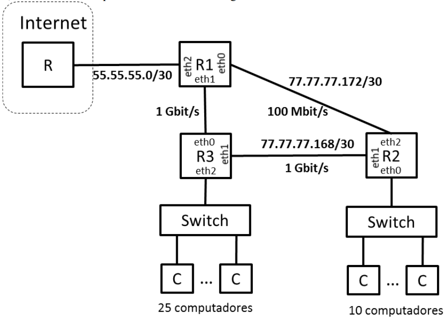

## Exame 2019

### Parte 1

#### Pergunta 1

A camada de rede IP fornece ao protocolo UDP um serviço que
- a) Garante a entrega de todos os pacotes pela sequência correta.
- b) Garante a entrega de todos os pacotes mas não a sua sequência.
- c) Não garante a entrega de todos os pacotes mas garante a sequência dos pacotes entregues.
- d) Não garante a entrega de todos os pacotes nem a sua sequência. :heavy_check_mark:

#### Pergunta 2

Um canal de comunicações do tipo passa-baixo tem uma largura de banda de 2 kHz. Se o débito transmitido nesse canal for de 12 kbit/s estão a ser usados impulsos de
- a) 6 níveis.
- b) 8 níveis. :heavy_check_mark:
- c) 12 níveis.
- d) 64 níveis.

#### Pergunta 3
Através de um canal de comunicações caracterizado por um Bit Error Ratio (BER) conhecido são transmitidas tramas de dados. Admitamos 2 cenários: Cenário 1 - transmissão de tramas de comprimento L1 bits; Cenário 2 transmissão de tramas de comprimento L2 =10*L1 bits. Nesta situação, poderemos afirmar que o Frame Error Ratio do Cenário 1 (FER1) e o Frame Error Ratio do Cenário 2 (FER2) estão relacionados da seguinte forma:
- a) FER1 < FER2. :heavy_check_mark:
- b) FER1 > FER2.
- c) FER1 = FER2.
- d) A informação fornecida não é suficiente para se retirar uma conclusão.

#### Pergunta 4
Os mecanismos ARQ podem ser usados ligação-a-ligação (ARQ-LL) ou extremo-a-extremo (ARQ-EE). Assuma que entre o emissor e o recetor existem N ligações e que as ligações têm um FER elevado. Se quisermos que a rede seja simultaneamente fiável e eficiente deveremos usar
- a) ARQ-LL. :heavy_check_mark:
- b) ARQ-EE.
- c) É irrelevante.
- d) Não deveremos usar nenhum ARQ.

#### Pergunta 5
Considere um mecanismo ARQ Go-Back-N que usa 2 bits para numerar as tramas. Considere também a notação para representação do funcionamento do Emissor em que ?RR(1).!I(1).SW representa a receção (?) da mensagem RR(1) seguida (.) da emissão (!) da mensagem I(1) seguida (.) de uma paragem e espera de confirmação (SW – Stop and Wait). Assumindo que o emissor tem sempre tramas para enviar, o funcionamento do Emissor caracterizado pela sequência de eventos !I(0).?RR(1) poderá ser seguido por
- a) !I(1).!I(2).SW
- b) !I(1).!I(2).!I(3).SW :heavy_check_mark:
- c) !I(1).!I(2).!I(3).!I(0).SW
- d) !I(1).!I(2).!I(3).!I(4).SW

#### Pergunta 6
Considere duas filas de espera, uma M/M/1 e outra D/D/1, ambas caracterizadas por uma intensidade de tráfego ρ=0,8. Nesta situação
- a) a fila M/M/1 tem um número médio de pacotes N inferior ao da fila D/D/1.
- b) a fila M/M/1 tem um número médio de pacotes N igual ao da fila D/D/1.
- c) a fila M/M/1 tem um número médio de pacotes N superior ao da fila D/D/1. :heavy_check_mark:
- d) É impossível responder porque não são conhecidas as taxas de chegada nem de serviço das filas.

#### Pergunta 7
Considere a tecnologia de acesso ao meio Carrier Sense Multiple Access/Collision Avoidance (CSMA/CA), o tempo  de transmissão de uma trama Tframe e o tempo de propagação de uma trama no meio partilhado Tprop. O CSMA/CA  usa-se em situações em que
- a) Tframe >> Tprop. :heavy_check_mark:
- b) Tframe é aproximadamente igual a Tprop.
- c) Tframe << Tprop.
- d) A sua utilização é independente da relação entre Tframe e Tprop.

#### Pergunta 8
A tabela NAT de um router tem a seguinte entrada < (140.76.29.6, 80), (172.16.1.4, 8080) >. A rede privada tem o endereço 172.16.0.0/16 e existe um servidor HTTP na porta 8080 da máquina com o endereço 172.16.1.4. A interface do router na rede pública tem o endereço MAC AA::AA. A interface do servidor HTTP tem o endereço MAC BB::BB. Nesta situação, os endereços IP e MAC de origem de uma trama observada na rede pública proveniente deste servidor são os seguintes
- a) IPorig=140.76.29.6, MACorig= AA::AA. :heavy_check_mark:
- b) IPorig=140.76.29.6, MACorig= BB::BB.
- c) IPorig=172.16.1.4, MACorig= AA::AA.
- d) IPorig=172.16.1.4, MACorig= BB:BB.

#### Pergunta 9

O valor da janela de congestionamento de uma ligação TCP
- a) é calculado pelo emissor e mantém-se constante durante uma ligação TCP.
- b) é calculado pelo emissor e pode variar durante uma ligação TCP. :heavy_check_mark:
- c) é calculado pelo recetor, enviado por este ao emissor no campo Window Size da mensagem de ACK e mantém-se constante durante uma a ligação TCP.
- d) é calculado pelo recetor, enviado por este ao emissor no campo Window Size da mensagem de ACK e pode variar durante uma ligação TCP.

#### Pergunta 10

No protocolo FTP, em resposta ao pedido de transferência de dados em modo passivo, o servidor envia ao cliente
- a) O endereço da porta do cliente para a ligação de controlo.
- b) O endereço da porta do cliente para a ligação de dados.
- c) O endereço da porta do servidor para a ligação de controlo.
- d) O endereço da porta do servidor para a ligação de dados. :heavy_check_mark:

### Parte 2

#### Pergunta 1
Duas estações comunicam usando uma ligação de dados baseada em mecanismos ARQ. A capacidade do canal é de 800 kbit/s, o atraso de propagação (num sentido) é de 20 ms e as tramas de Informação têm um tamanho fixo de 1000 octetos. Considere que são usados 2 bits para numerar as tramas de Informação e que as tramas de controlo têm um tamanho desprezável.

##### Item (a)

Calcule a eficiência máxima do protocolo para as variantes Stop and Wait, Go Back N e Selective Repeat. Calcule também os débitos máximos correspondentes.

|                        | Stop and Wait | Go Back N | Selective Repeat |
|------------------------|---------------|-----------|------------------|
| Eficiência máxima (%)  | 20            | 60        | 40               |
| Débito máximo (kbit/s) | 160           | 480       | 320              |

##### Item (b)

Pretende-se analisar o efeito dos erros de transmissão e do tamanho das tramas de Informação. Considere tramas com tamanhos 1000 e 2000 octetos e uma situação de ruído caracterizada por Bit Error Ratio BER=10-4. Calcule a eficiência máxima dos três mecanismos para estes casos e discuta o comportamento destes mecanismos face ao aumento do tamanho das tramas

| Smax (%)         | Stop and Wait | Go Back N | Selective Repeat |
|------------------|---------------|-----------|------------------|
| L = 1000 octetos | 9,0           | 12,8      | 18,0             |
| L = 2000 octetos | 6,7           | 7,8       | 13,5             |

Nota de resolução:

- Comprimentos L diferentes originam FER's diferentes, Tframe's diferentes e a's diferentes

##### Item (c)

Suponha que se pretendia fazer uma ligação para um satélite localizado a 30 000 km de altitude com um débito de 100 kbit/s. Para a eficiência máxima, tramas de 1000 octetos e transmissão feita num canal de 20kHz, qual seria número mínimo de bits necessários para numerar as tramas e qual seria a relação sinal-ruído (SNR – Signal to Noise Ratio) necessária no recetor, em dB. A velocidade da luz é de 3*10^8 m/s.

|                   |    |
|-------------------|----|
| Número de bits, k | 3  |
| SNR (dB)          | 15 |

Notas de resolução:
- Se SNR for elevado, BER~0 e FER~0
- GBN e SR podem atingir eficiências S=1 se W >= 1+2a
- Sendo Débito= S*Capacidade, se S=1 então Capacidade = Débito
- A lei de Shannon dá-nos a capacidade máxima de um canal sem erros, atingível pelas tecnologias mais recentes: C= Bc log2 (1+SNR); neste caso Bc= 20 kHz
- SNRdB= 10 log10(SNR)

#### Pergunta 2

Através de uma porta de saída de um comutador de tramas é encaminhado tráfego recebido em 8 portas de entrada. Admita que a porta de saída tem uma capacidade de 100 Mbit/s e que todas as portas de entrada contribuem com fluxos de tráfego iguais.

##### Item (a)
Admitindo que poderemos usar uma fila M/M/1 para modelizar a porta de saída e que as tramas têm um comprimento médio de 500 Bytes, calcule o débito máximo de cada fluxo de entrada para que a porta de saída tenha uma utilização inferior a 90%. Calcule também o tempo médio de espera dos pacotes (Tw) e a ocupação média da fila de espera (Nw).

|                                               |       |
|-----------------------------------------------|-------|
| Débito de fluxo na porta de entrada, (Mbit/s) | 11,25 |
| Tempo médio de atraso dos pacotes, Tw, (μs)   | 360   |
| Ocupação média da fila de espera, Nw          | 8,1   |

##### Item (b)

Admita agora que a fila de espera é finita. Calcule o número mínimo de buffers B associados à fila de espera para que a probabilidade de perda de pacotes seja inferior a 1% nas duas situação seguintes:

1. o tráfego de entrada total é igual a 90% da capacidade da porta de saída;
2. o tráfego de entrada total é igual à capacidade da porta de saída.

| ---          | Situação (i) | Situação (ii) |
|--------------|--------------|---------------|
| Nº buffers B | 23           | 99            |

##### Item (c)

Admita que o tráfego de entrada da alínea a) duplicava e que as tramas passavam e ter comprimento constante. Para suportar este tráfego pretende-se estudar duas situações alternativas:

1. duplicar a capacidade da porta de saída;
2. constituir duas VLANs de 4 portas de entradas cada, associando a cada VLAN uma porta de saída de capacidade de 100 Mbit/s.

Para estas duas situações, calcule o tempo médio de atraso do pacotes (T) e a ocupação média da fila (N). Indique, justificando, qual das duas soluções lhe parece ser a melhor.

|                                              | Situação (i) | Situação (ii) |
|----------------------------------------------|--------------|---------------|
| Tempo médio de atraso dos pacotes, T, (μs)   | 110          | 220           |
| Ocupação média da fila de espera, N          | 5            | 5             |

Notas de resolução:
- Comprimento constante dos pacotes → fila M/D/1
- Tw = ρ/[2μ(1-ρ)]
- Situação (i): μ(i) = 2μ ; λ(i) = 2λ ; ρ(i) = ρ
- Situação (ii): μ(ii)= μ ; λ(ii) = λ ; ρ(ii) = ρ

#### Pergunta 3

Considere que a uma empresa foi atribuído o bloco de endereços IP 77.77.77.128/26. A empresa tem uma rede de comunicações com a arquitetura descrita na figura, composta por 3 routers (R1, R2, R3) e 2 switches Ethernet. Um dos switches serve 25 computadores e outro serve 10 computadores. Os routers estão interligados por ligações ponto-a-ponto e a algumas destas ligações estão já atribuídos os endereços indicados na figura. As ligações entre os routers R1, R2 e R3 têm as capacidades indicadas nas figura.

##### Item (a)

Calcule os endereços associados às redes indicadas. A endereço da rede da ligação R1-R3 deverá ser o mais baixo possível.

|                               | Endereço da subrede (endereço/máscara) | Endereço de broadcast da subrede | Nº de endereços de interfaces |
|-------------------------------|----------------------------------------|----------------------------------|-------------------------------|
| Rede dos 25 computadores      | 77.77.77.128/27                        | 77.77.77.159                     | 30                            |
| Rede dos 10 computadores      | 77.77.77.176/28                        | 77.77.77.191                     | 14                            |
| Rede da ligação R1-R3         | 77.77.77.160/30                        | 77.77.77.163                     | 2                             |

##### Item (b)

Atribua endereços IP às interfaces de rede indicadas na tabela. Use os endereços mais baixos de cada subrede. Numa sub-rede atribua os endereço mais baixo ao routers de índice Ri mais baixo. Por exemplo, o endereço de R1.eth0 deverá ser inferior ao endereço R2.eth2.

| Interface Router | Endereço IP  |
|------------------|--------------|
| R1.eth0          | 77.77.77.173 |
| R2.eth2          | 77.77.77.174 |
| R2.eth0          | 77.77.77.177 |
| R2.eth1          | 77.77.77.169 |
| R3.eth1          | 77.77.77.170 |

##### Item (c)

Escreva a tabela de encaminhamento do router R2. Este router deverá ser capaz enviar pacotes para todos os endereços IP unicast e os pacotes deverão ser encaminhados pelos caminhos de custo mais baixo. Assuma que o custo de uma ligação é o inverso (1/x) da sua capacidade; por exemplo, a ligação com capacidade de 1 Gbit s tem um custo de 10^(-9). Use o menor número possível de entradas na tabela.

| Destino (endereço/máscara) | Gateway      | Interface |
|----------------------------|--------------|-----------|
| 77.77.77.176/28            | -            | eth0      |
| 77.77.77.172/30            | -            | eth2      |
| 77.77.77.168/30            | -            | eth1      |
| 0/0                        | 77.77.77.170 | eth1      |
