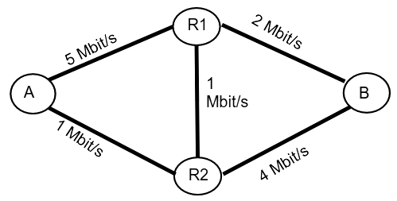
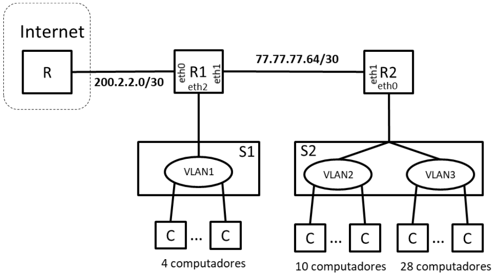

## Exame 2020

### Parte 1

#### Pergunta 1

Uma rede composta por um conjunto de routers IP interligados entre si constitui
- a) Uma rede de circuitos virtuais e oferece um serviço orientado às ligações.
- b) Uma rede de circuitos virtuais e oferece um serviço não orientado às ligações.
- c) Uma rede de comutação de pacotes e oferece um serviço orientado às ligações.
- d) Uma rede de comutação de pacotes e oferece um serviço não orientado às ligações. :heavy_check_mark:

**Justificação:** Se são vários routers interligados então não é uma rede de circuitos virtuais, mas sim uma rede de comutação de pacotes. Uma rede não ofereçe um serviço orientado às ligações, dado que o protocolo IP não refere o que é uma ligação (por exemplo, TCP define o que é uma ligação, e TCP é baseado em ligações).

#### Pergunta 2

A eficiência de um canal rádio (bit/s/Hz), caracterizável pela lei de Shannon log2(1+SNR),

- a) Aumenta quando a distância entre o emissor e o recetor (d) diminui e é independente da largura de banda do canal (B).
- b) Aumenta quando d diminui e B diminui. :heavy_check_mark:
- c) É independente de d.
- d) Nenhuma das anteriores é verdadeira.

**Justificação:** Pela lei de Shannon, a eficiência de um canal é independente de B. A eficiência não depende diretamente de d, mas como um aumento de d provoca atenuação do sinal, o SNR diminui e a eficiência do canal diminui também.

#### Pergunta 3

Se a probabilidade de uma trama ser recebida com erros for F e se esta mesma trama for transmitida L vezes, então a probabilidade da trama ser recebida corretamente é
- a) F^L
- b) 1-F^L :heavy_check_mark:
- c) 1-(1-F)^L
- d) 1-(1-L)^F

**Justificação:** F é a probabilidade de a trama falhar 1 vez. F^L é a probabilidade de a trama falhar L vezes.Assim, 1-F^L é a probabilidade de a trama não falhar L vezes, ou seja ser corretamente transmitida pelo menos uma vez.

#### Pergunta 4

Considere o mecanismo ARQ Selective-Repeat estudado nas aulas e usando 2 bits de numeração. Considere também que o funcionamento do Emissor é descrito numa notação em que !I(0).?RR(1) representa a emissão (!) da mensagem I(0) seguida (.) da receção (?) da mensagem RR(1). Após a ocorrência dos eventos !I(0).!I(1), o emissor
- a) Envia de imediato a mensagem I(0).
- b) Envia de imediato a mensagem I(2).
- c) Envia de imediato a mensagem RR.
- d) Para e espera por receção de uma mensagem de confirmação.

**Justificação:** k=2; por se tratar de Selective Repeat, W=2^(k-1)=2^(2-1)=2^1=2; assim o tamanho máximo da janela é 2. Como já foram enviadas as mensagens I(0) e I(1), não podem ser enviadas mais mensagems até ser recebido um ACK, dado que a janela está cheia.

#### Pergunta 5

Considere uma interface de comunicações de rede modelizável por uma fila de espera M/M/1 caracterizada por uma taxa de chegada de λ pacote/s uma capacidade de C bit/s, que origina um número médio de pacotes na fila N e um atraso médio de T. Se esta fila passar a ser caracterizada por λ'=10.λ e C'=10.C, então, para o mesmo comprimento médio dos pacotes,
- a) N'=N e T'=T
- b) N'=N/10 e T'=T/10
- c) N'=N e T'=T/10 :heavy_check_mark:
- d) N'=N/10 e T'=T

**Justificação:**  
1/μ=L/C <=> μ=C/L  
ρ=λ/μ=λL/C  
T_W=ρ/(μ(1-ρ))=(λL/C)/((C/L)(1-(λL/C)))=λL/((C^2/L)(1-(λL/C)))=λL/((C/L)(C-λL))=λL²/(C(C-λL))  
T_W'=λ'L²/(C'(C'-λ'L))=10λL²/(10C(10C-10λL))=10λL²/(100C(C-λL))=(λL²/(C(C-λL)))/10=T_W/10   
N_W=λ\*T_W  
N_W'=λ'\*T_W'=10λ\*(T_W/10)=λ\*T_W=N_W

#### Pergunta 6
Assuma um cenário composto por 2 computadores A e B implementando o protocolo de acesso ao meio CSMA/CD (Collision Detection), e interligados entre si através de um comutador Ethernet. As portas de rede dos computadores e do comutador funcionam em modo full-duplex. Se o computador A estiver a transmitir uma trama e o computador B também tiver uma trama para transmitir, o computador B
- a) Escuta até ao fim da transmissão de A e só depois transmite a sua trama. :heavy_check_mark:
- b) Transmite de imediato a sua trama causando uma colisão.
- c) Transmite de imediato a trama mas só haverá colisão se a trama enviada por A tiver como destino B.
- d) Transmite de imediato e não haverá colisão. :heavy_check_mark:

**Justificação:** Se a ligação for full-duplex não há problema. Só existe problema quando as ligações são half-duplex.

#### Pergunta 7
Assuma o seguinte cenário de ligações [A]—0[SW]1—0[RT]1—[B]. Neste cenário, o computador A está ligado à porta 0 do comutador Ethernet SW, a porta 1 do comutador SW está ligada à porta 0 do router RT, e o computador B está ligado diretamente à porta 1 do router RT. Nesta situação, quando o computador B envia um pacote IP para o computador A, os endereços IP e MAC de origem constantes da trama recebida pelo computador A são os seguintes:
- a) Endereço IP de B, endereço MAC de SW.porta0
- b) Endereço IP de B, endereço MAC de RT.porta0 :heavy_check_mark:
- c) Endereço IP de B, endereço MAC de B.
- d) Endereço IP de RT.porta0, endereço MAC de SW.porta0.

**Justificação:** Possui o endereço IP de B, porque obviamente esse foi o emissor original. Possui o endereço MAC de RT.porta0 porque as portas do switch não precisam de MAC addresses; o switch é que é responsável por redirecionar MAC addresses, mas as portas do switch não precisam de MAC addresses.

#### Pergunta 8
Assuma dois computadores ligados à Internet e uma ligação TCP estabelecida entre eles. A distância que separa os computadores é de D, a capacidade mínima da várias ligações atravessadas pelos pacotes é C, o valor médio da janela de congestionamento da ligação TCP é W e o Round Trip Time é R. Nesta situação, o débito médio esperado para esta ligação TCP é de:
- a) C.
- b) W/R. :heavy_check_mark:
- c) CR/W.
- d) WD.

**Justificação:** O protocolo Ethernet (sob o qual o protocolo TCP assenta) usa um algoritmo semelhante a Selective Repeat.  
R=2Tprop <=> Tprop=0.5R
Tf = 1/C  
a=Tprop/Tf=0.5R/(1/C)=0.5RC  
S=W/(1+2a)=W/(1+RC)  
Debito=S*C=W/(1/C+R)  
Assumindo que C é grande, 1/C é pequeno e o débito fica W/R.

De forma mais simples: usando o teorema de Little, N = λT <=> λ = N/T. O débito médio é λ por definição, N é o número médio de clientes na fila (que é equivalente ao tamanho da janela W), e T é o tempo total no sistema (que é equivalente a R).

#### Pergunta 9
Que protocolo de transporte (UDP ou TCP) usaria para as seguintes aplicações: A1) obtenção de informação do servidor de nomes DNS; A2) envio de um email; A3) transferência de voz em pacotes.
- a) A1=UDP; A2=TCP; A3=TCP.
- b) A1=UDP; A2=TCP; A3=UDP. :heavy_check_mark:
- c) A1=TCP; A2=TCP; A3=UDP.
- d) Outra combinação.

**Justificação:**  
A1: o protocolo DNS usa UDP para devolver a informação que foi pedida; isto permite menor overhead, por não requerer o estabelecimento de uma ligação ao nameserver.  
A2: um email possui conteúdo importante e que não precisa de ser transmitido em tempo real, logo é melhor usar TCP por ser mais fiável e garantir a correta entrega do email.  
A3: a transferência de voz em pacotes em tempo real requer uma ligação o mais rápida possível, em que geralmente se prefere que o tempo de transferência seja o menor possível em vez de estabelecer uma ligação reliable mas mais lenta. A perda de pacotes de voz em tempo real não é preocupante, logo usa-se UDP.

#### Pergunta 10

Admita que 2 nós A e B se encontram interligados através da rede composta pelos comutadores R1 e R2 e pelas ligações bidirecionais com as capacidades indicadas na figura. Assumindo que o custo das ligações é inversamente proporcional ao valor da sua capacidade e que todos os pacotes enviados de A para B seguem o caminho de custo mínimo, o débito máximo possível entre A e B é de

- a) 1 Mbit/s
- b) 2 Mbit/s :heavy_ckeck_mark:
- c) 4 Mbit/s
- d) 5 Mbit/s

**Justificação:**  
A - R1: 0.2  
A - R2: 1  
B - R1: 0.5  
B - R2: 0.25  
R1 - R2: 1  
O caminho mais curto é A->R1->B, que tem uma capacidade minima de 2Mbit/s.

### Parte 2

#### Pergunta 1
Duas estações comunicam usando uma ligação de dados baseada num mecanismo ARQ do tipo Selective Repeat. A capacidade do canal, em cada sentido, é de 2 Mbit/s, o atraso de propagação entre estações é de 250 ms e os pacotes têm um tamanho de 250 Bytes. Assuma duas situações de erro distintas: BER1=0 e BER2=10^-4.

##### Item (a)
Considere inicialmente que as tramas são numeradas módulo 64. Calcule a eficiência máxima do protocolo e o débito máximo para as duas situações de erro.

**Resposta:**

| Selective Repeat ARQ   | BER1=0 | BER2=10^-4 |
|------------------------|--------|------------|
| Eficiência máxima (%)  | 6.38   | 5.23       |
| Débito máximo (kbit/s) | 127.6  | 104.6      |

C = 2 Mbit/s = 2e6 bit/s  
L = 250 B = 2000 bit  
Tprop = 0.250 s  
Tf = L/C = 2000 bit / 2e6 bit/s = 0.001 s  
W = 64/2 = 32  
a = Tprop/Tf = 0.250 s / 0.001 s = 250  

Uma trama ter um erro é a negação de todos os bits da trama estarem corretos:  
pe = 1-(1-BER)^L  

Como W < 1+2a <=> 32 < 1+2*250 <=> 32 < 501,  
S = W(1-pe)/(1+2a)

| BER1 = 0          | BER2 = 10^-4      |
|-------------------|-------------------|
| pe=0              | pe=0.181277       |
| S=0.0638          | S=0.0523          |
| Cmax=127.6 kbit/s | Cmax=104.6 kbit/s |

##### Item (b)
Determine o tamanho da janela de transmissão (e o módulo de numeração correspondente) que permitiria teoricamente obter a eficiência máxima do canal para as duas situações de erro indicadas. Calcule a eficiência máxima obtida para os módulos de numeração identificados nas duas situações de erro.

**Resposta:**

| Selective-Repeat ARQ                                     | BER1=0 | BER2=10^-4 |
|----------------------------------------------------------|--------|------------|
| Tamanho da janela de transmissão                         | 512    | 512        |
| Módulo de numeração para a janela crítica de transmissão | 1024   | 1024       |
| Eficiência máxima (%)                                    | 100    | 81.8       |

A eficiência máxima é obtida quando W ≥ 1+2a. Assim, vamos descobrir W=1+2a.

Em ambas as situações, a é igual, logo W=1+2a=1+2*250=501. Como 501 exige 9bits, aproveitando todas as possibilidades com 9bits temos W=2^9=512.

A janela é metade do módulo M, logo M = 2W = 1024.

A eficiência máxima é Smax=1-pe.

| BER1 = 0          | BER2 = 10^-4      |
|-------------------|-------------------|
| pe=0              | pe=0.181277       |
| S=1               | S=0.818723        |

##### Item (c)
Considere agora que se adiciona a cada trama um código corretor de erros e admita dois cenários:

###### Item (i)
no Cenário A usa-se um código que aumenta o tamanho da trama em 10% e origina um Frame Error Ratio(FER) de 10%.

###### Item (ii)
no Cenário B usa-se um código que aumenta o tamanho da trama em 30% e origina um FER de 5%.

Assuma as condições da alínea a).

Calcule a eficiência máxima e o débito máximo útil para os 2 cenários.

**Resposta:**

| Selective Repeat ARQ        | Cenário A | Cenário B |
|-----------------------------|-----------|-----------|
| Eficiência máxima (%)       | 6.33      | 7.89      |
| Débito máximo útil (kbit/s) | 115       | 121       |

C = 2 Mbit/s = 2e6 bit/s  
Tprop = 0.250 s  
W = 64/2 = 32  

| Cenário A                                    | Cenário B                                  |
|----------------------------------------------|--------------------------------------------|
| L = 2200 bit                                 | L = 2600 bit                               |
| pe = 0.10                                    | pe = 0.05                                  |
| Tf = L/C = 2200 bit / 2e6 bit/s = 0.0011 s   | Tf = L/C = 2600 bit / 2e6 bit/s = 0.0013 s |
| a = Tprop/Tf = 0.250 s / 0.0011 s = 227      | a = Tprop/Tf = 0.250 s / 0.0013 s = 192    |
| S = W(1-pe)/(1+2a) = 0.0633                  | S = W(1-pe)/(1+2a) = 0.0789                |
| Debito = S\*C/ratio, ratio=1.1               | Debito = S\*C/ratio, ratio=1.3             |

#### Pergunta 2
Admita que um sistema de transmissão é modelizado por uma fila de espera M/M/1 de capacidade infinita. Verifica-se que em média chegam ao sistema 600 pacote/s, de comprimento médio 1500 Bytes, e que a linha de transmissão está vazia em 40% do tempo.

##### Item (a)

Calcule a capacidade da linha de transmissão, a ocupação média da fila de espera e o tempo médio de atraso dos pacotes.

**Resposta:**

|                                            |     |
|--------------------------------------------|-----|
| Capacidade da linha (Mbit/s)               | 12  |
| Ocupação média da fila de espera, Nw       | 0.9 |
| Tempo médio de atraso dos pacotes, T, (ms) | 2.5 |

L = 1500 B = 12000 bit  
λ = 600 pac/s = 7.2e6 bit/s  
ρ = 0.60  
ρ = λ/μ <=> μ = λ/ρ = 7.2e6 bit/s / 0.60 = 12e6 bit/s  
Nw = N-ρ = ρ/(1-ρ)-ρ = 0.6/(1-0.6)-0.6 = 0.6/0.4-0.6 = 1.5-0.6 = 0.9  
T = 1/(μ-λ) = 1/(12e6 bit/s - 7.2e6 bit/s) = 1/(4.8e6 bit/s) = 0.000000208 s/bit = 0.0025 s/pac = 2.5 ms/pac

##### Item (b)

Calcule a probabilidade de haver pacotes no sistema em duas situações diferentes: i) a fila tem capacidade infinita; ii) a fila tem uma capacidade de 1 buffer.

**Resposta:**

|                                | Prob [NumPacotes > 0] |
|--------------------------------|-----------------------|
| i) Fila de capacidade infinita | 0.6                   |
| ii) Fila com 1 buffer          | 0.375                 |

Numa queue M/M/1/B,  
P(0) = (1-ρ)/(1-ρ^(B+1))  
Prob[NumPacotes > 0] = 1-P(0) = 1-(1-ρ)/(1-ρ^(B+1))

ρ = 0.60  
Prob[NumPacotes > 0]i  = 1-(1-0.6)/(1-0.6^(∞+1)) = 1-(1-0.6)/(1-0) = 1-0.4/1 = 0.6  
Prob[NumPacotes > 0]ii = 1-(1-0.6)/(1-0.6^(1+1)) = 1-(1-0.6)/(1-0.36) = 1-0.4/0.64 = 0.375

##### Item (c)

Admita que, nas condições da alínea a), os pacotes passavam a ter um comprimento constante de 1500 Bytes. Calcule a capacidade da linha de transmissão, a ocupação média da fila de espera e o tempo médio de atraso dos pacotes. Discuta e compare estes resultados com os resultados obtidos na alínea a).

**Resposta:**

|                                            |      |
|--------------------------------------------|------|
| Capacidade da linha (Mbit/s)               | 12   |
| Ocupação média da fila de espera, Nw       | 0.45 |
| Tempo médio de atraso dos pacotes, T, (ms) | 1.75 |

Como os pacotes têm comprimento constante, o tempo de serviço deixa de ter distribuição de Poisson e passa a ser constante. Assim, podemos modelar este problema como uma fila M/D/1.

λ = 600 pac/s  
μ = 12e6 bit/s = 1000 pac/s  
ρ = 0.60  
Tw = ρ/(2μ(1−ρ)) = 0.00075 s/pac  
Nw = λ\*Tw = 0.45  
T = Tw+1/μ = 0.00175 s/pac = 1.75 ms/pac 

#### Pergunta 3

À Empresa A foi atribuído o bloco de endereços 77.77.77.64/26. A empresa tem um rede de comunicações com a arquitetura descrita na figura, composta por dois routers (R1 e R2) e dois comutadores Ethernet (S1 e S2). O comutador S1 tem configurada a VLAN1 que serve 4 computadores. O comutador S2 tem configurada a VLAN2 e a VLAN3 que servem respetivamente 10 e 28 computadores. Os routers R1 e R2 estão interligados por uma ligação ponto-a-ponto que usa o endereço de rede indicado na figura.

##### Item (a)

Calcule os endereços associados às redes indicadas.

**Resposta:**

Primeiro, calculamos o número de endereços de interfaces que seja o menor possível mas que permita atribuir um endereço a todos os computadores, em cada rede.

|       | Endereço da subrede (endereço/máscara) | Endereço de broadcast da subrede | Nº de endereços de interfaces |
|-------|----------------------------------------|----------------------------------|-------------------------------|
| VLAN1 | 77.77.77.??/29                         | TODO                             | 6  (=2^3-2)                   |
| VLAN2 | 77.77.77.??/28                         | TODO                             | 14 (=2^4-2)                   |
| VLAN3 | 77.77.77.??/27                         | TODO                             | 30 (=2^5-2)                   |

Depois preenchemos os bits de acordo com a mask de cada rede, e tendo em conta que a empresa recebeu o bloco 77.77.77.64/26 (77.77.77.01??????)

|       | Endereço da subrede (endereço/máscara) | Endereço de broadcast da subrede | Nº de endereços de interfaces |
|-------|----------------------------------------|----------------------------------|-------------------------------|
| VLAN1 | 77.77.77.01???000/29                   | 77.77.77.01???111                | 6                             |
| VLAN2 | 77.77.77.01??0000/28                   | 77.77.77.01??1111                | 14                            |
| VLAN3 | 77.77.77.01?00000/27                   | 77.77.77.01?11111                | 30                            |

Em VLAN3, o último octeto não pode ser 01000000 porque seria igual ao endereço de R2, logo o endereço da subrede VLAN3 é 77.77.77.01100000/27 = 77.77.77.90/27  
Em VLAN1 e VLAN2, o último octeto não pode começar em 011, dado que esses endereços pertencem a VLAN3; logo, ambos começam com 010.  
Em VLAN2, o último octeto não pode ser 01000000 porque esse endereço é o do R2, logo o endereço da subrede VLAN2 é 77.77.77.01010000/28 = 77.77.77.80/28  
Assim sobra VLAN1, que não pode ter o último octeto a começar por 0101 nem por 01001 (ambos pertencem a VLAN2), logo o endereço da subrede VLAN1 é 77.77.77.01001000 = 77.77.77.72/29

|       | Endereço da subrede (endereço/máscara) | Endereço de broadcast da subrede | Nº de endereços de interfaces |
|-------|----------------------------------------|----------------------------------|-------------------------------|
| VLAN1 | 77.77.77.01001000/29                   | 77.77.77.01001111                | 6                             |
| VLAN2 | 77.77.77.01010000/28                   | 77.77.77.01011111                | 14                            |
| VLAN3 | 77.77.77.01100000/27                   | 77.77.77.01111111                | 30                            |

|       | Endereço da subrede (endereço/máscara) | Endereço de broadcast da subrede | Nº de endereços de interfaces |
|-------|----------------------------------------|----------------------------------|-------------------------------|
| VLAN1 | 77.77.77.72/29                         | 77.77.77.79                      | 6                             |
| VLAN2 | 77.77.77.80/28                         | 77.77.77.95                      | 14                            |
| VLAN3 | 77.77.77.96/27                         | 77.77.77.127                     | 30                            |

##### Item (b)

Atribua endereços IP às interfaces de rede indicadas na tabela. Use os endereços mais altos de cada subrede. Numa sub-rede atribua os endereços mais baixos aos routers de índice Ri mais baixo. Por exemplo, o endereço de R1.eth1 deverá ser inferior ao endereço de R2.eth1.

| Router.interface | Endereço(s) IP            |
|------------------|---------------------------|
| R1.eth1          | 77.77.77.65               |
| R2.eth1          | 77.77.77.66               |
| R1.eth2          | 77.77.77.78               |
| R2.eth0          | 77.77.77.126              |

##### Item (c)

Escreva a tabela de encaminhamento do router R2. Este router deverá ser capaz enviar pacotes para todos os endereços IP unicast. Use o menor número possível de entradas na tabela.

(Estenda a tabela com as linhas que for necessário)

TODO

| Destino (endereço/máscara) | Gateway     | Interface | 
|----------------------------|-------------|-----------|
| 0/0                        | 77.77.77.65 | eth1      |
| 77.77.77.80/28             | -           | eth0      |
| 77.77.77.96/27             | -           | eth0      |
