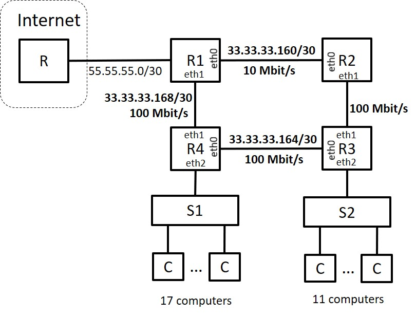

## Exam 2021

### Question 1

The transport protocol UDP (User Datagram Protocol) offers to the applications using it
- a. A connectionless unreliable service.
- b. A connection-oriented reliable service.
- c. I DO NOT ANSWER THIS QUESTION.
- d. A connectionless reliable service. :heavy_check_mark:
- e. A connection-oriented unreliable service.

### Question 2

A system transmitting 100 kSymbol/s using a 4QAM modulation transmits a bitrate of
- a. 400 kbit/s.
- b. 50 kbit/s
- c. 200 kbit/s. :heavy_check_mark:
- d. I DO NOT ANSWER THIS QUESTION.
- e. 100 kbit/s.

### Question 3

A data link characterised by Bit Error Ratio (BER) is used to transmit data frames. Let us assume 2 scenarios:

- Scenario A - transmission of frames having a length of L bits;
- Scenario B - transmission of frames having a length L/10 bits.

In this situation,
- a. FERa > FERb. :heavy_check_mark:
- b. I DO NOT ANSWER THIS QUESTION.
- c. Frame Error Ratio in Scenario A (FERa) is smaller than Frame Error Ratio in Scenario B (FERb): FERa < FERb.
- d. The information provided is insufficient to draw a conclusion.
- e. FERa = FERb.

### Question 4

Consider a ARQ Go-Back-N mechanism using 1 bit for numbering frames. The transmitter behaviour is described in a notation where, for instance, ?RR(1).!I(1).SW represents the reception (?) of frame RR(1) followed (.) by the transmission (!) of frame I(1), followed (.) by a stop and wait (SW). Assuming the transmitter always has frames to transmit, if the transmitter behaved as !I(0).?RR(1) then its behaviour can be characterised by
- a. !I(0).SW
- b. !I(1).SW :heavy_check_mark:
- c. !I(1).!I(0).SW
- d. I DO NOT ANSWER THIS QUESTION.
- e. !I(0).!I(1).SW

### Question 5

Assume a network interface modelled by a stable M/D/1 waiting queue, characterised by an average arrival rate of 𝜆λ packet/s, a line capacity of C bit/s, and packet length of L bit. In this system, the average rate of transmitted packets is

- a. λ :heavy_check_mark:
- b. C
- c. I DO NOT ANSWER THIS QUESTION.
- d. C/L
- e. L/C

### Question 6

Assuming that A>B indicates that the maximum throughput (received bitrate) enabled by protocol A is higher than the maximum throughput enabled by protocol B, the following is true
- a. I DO NOT ANSWER THIS QUESTION.
- b. Aloha > Slotted Aloha > TDM
- c. Slotted Aloha > Aloha > TDM
- d. TDM > Slotted Aloha > Aloha :heavy_check_mark:
- e. TDM > Aloha > Slotted Aloha

### Question 7

Assume the following connections scenario

```txt
[A]--0[SW]1--0[RT]1--[B]
```

In this scenario, computer A is connected to port 0 of the Ethernet switch SW, port 1 of the switch SW is connected to port 0 of the router RT, and computer B is connected directly to port 1 of the router RT. In this situation, when computer A sends an ARP-Request so that it can communicate with computer B, the source MAC address of the ARP-Reply frame received by A is

- a. MAC address of RT.port0 :heavy_check_mark:
- b. MAC address of SW.port0
- c. MAC address of B.
- d. I DO NOT ANSWER THIS QUESTION.
- e. IP address of RT.porta0.

### Question 8

A router's forwarding table consists of entries in the format and contains the following entries

{<140.34.128.0/17, 1>, <140.34.0.0/24, 2>, <0/0, 3>}.

If to this router arrives a packet having the destination address 140.34.127.1, then the packet will be

- a. forwarded to port 2.
- b. forwarded to port 1.
- c. discarded.
- d. I DO NOT ANSWER THIS QUESTION.
- e. forwarded to port 3. :heavy_check_mark:

### Question 9

Assume two computers connected through TCP, having Round Trip Time (RTT) of 2 ms and no congestion. If the segment size is 2 kBytes, the time required to transmit 14 kBytes of data, excluding the time to setup the connection, is

- a. 6 ms. :heavy_check_mark:
- b. 4 ms.
- c. 10 ms.
- d. I DO NOT ANSWER THIS QUESTION.
- e. 8 ms.

### Question 10

In link-state routing, a node receives

- a. information about the links of all the nodes. :heavy_check_mark:
- b. information about the links of its neighbours, only.
- c. the distance-vectors of neighbour nodes, only.
- d. I DO NOT ANSWER THIS QUESTION.
- e. the distance-vectors of all the nodes.

### Question 11

Two stations comunicate using a Go-Back-N ARQ mechanism. The channel capacity in each direction is 600 kbit/s, the propagation delay between stations is 40 ms, the packet size is 300 bytes, the frames are numbered using module 32, and the Bit Error Ratio is BER=10^-4.

In this situation, the maximum efficiency of the protocol is

S=**15**%

### Question 12

If the Selective-Repeat ARQ mechanism is used, the maximum throughput (débito máximo) of this protocol is **360** kbit/s

### Question 13

If the Selective-Repeat ARQ mechanism is used and 𝐵𝐸𝑅=0BER=0, the maximum efficiency could be obtained for a packet size

L > **400** bytes.

### Question 14

The output port of an Ethernet switch has a capacity of 100 Mbit/s and is modeled as a M/M/1 queue. To this output port is forwarded all the traffic coming from 10 input ports. The average packet lenght is 10^4 bit. The utilization of the output port should be below 80%.
In this situation, the maximum average packet rate received by an input port should be smaller than **800** pac/s.

### Question 15

If the output queue has only 4 buffers (M/M/1/4), the probability of a packet being transmitted is **88**%.

### Question 16

In this queue of 4 buffers, if the packet lenght is constant and equal to 10^4 bit, then the maximum amount of time a packet has to wait before it starts to be transmitted is Tw=**300** μs.

### Question 17



Company A was assigned the IP address block 33.33.33.128/26. The company has a communications network with the architecture described in the figure, consisting of 4 routers (R1, R2, R3, R4) and two Ethernet switches (S1 and S2). Switch S1 serves 17 computers. Switch S2 serves 11 computers. Routers are connected by point-to-point links and to some of these links are assigned the network addresses shown in the figure.

The address of the network consisting of 11 computers, using the address/mask format (for example 88.88.88.128/30), is **33.33.33.176/28**.

### Question 18

The broadcast address of the network consisting of 17 computers is **33.33.33.159**

### Question 19

(Use the lowest address possible and do not indicate the mask)

The IP address of network interface R3.eth1 is **33.33.33.173**.

### Question 20

Considering that (1) the cost of a link is the inverse of its capacity, and (2) packets should use minimum cost paths, the default gateway of router R3 should be router

- a. R2.
- b. R1.
- c. R4. :heavy_check_mark:
