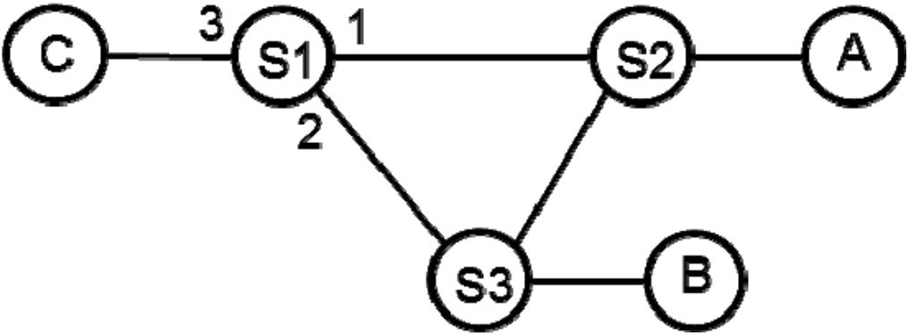
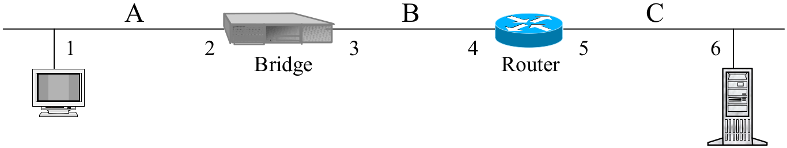
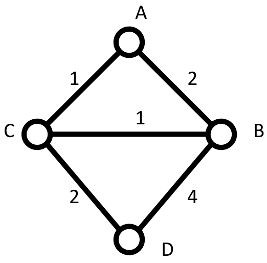
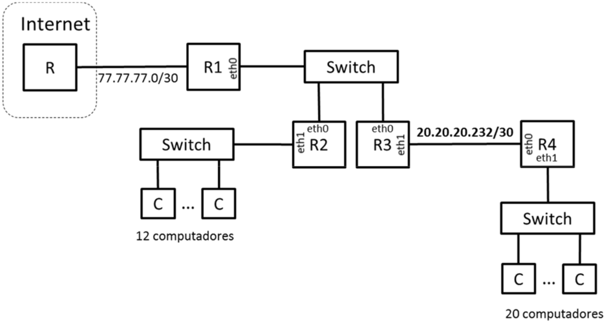

## Exame 2018

### Parte 1

#### Pergunta 1
Se numa transmissão de dados for usada para uma modulação 8PSK (constelação de 8 pontos) e um débito de 250 ksímbolo/s (250 kbaud), o débito binário obtido nesta ligação é de
- a) 250 kbit/s.
- b) 500 kbit/s
- c) 750 kbit/s. :heavy_check_mark:
- d) 2 Mbit/s.

#### Pergunta  2
O protocolo Internet Control Message Protocol (ICMP) usa serviços oferecidos pelo protocolo
- a) TCP.
- b) UDP.
- c) IP. :heavy_check_mark:
- d) Ethernet 802.3.

#### Pergunta 3
A distância mínima de um código de paridade par bi-dimensional é
- a) 1.
- b) 2.
- c) 4. :heavy_check_mark:
- d) 8.

#### Pergunta 4
Considere o mecanismo ARQ Selective-Repeat estudado nas aulas que usa 2 bits de numeração. Considere também que o funcionamento do Emissor é descrito numa notação em que !I(0).?RR(1) representa a emissão (!) da mensagem I(0) seguida (.) da receção (?) da mensagem RR(1). Após a ocorrência dos eventos !I(0).!I(1), o emissor
- a) Para e espera por receção de uma mensagem de confirmação. :heavy_check_mark:
- b) Envia de imediato a mensagem I(0).
- c) Envia de imediato a mensagem I(2).
- d) Envia de imediato a mensagem RR.

#### Pergunta 5
Assuma que 8 estações competem para aceder a um meio partilhado, que cada estação gera em média 1 pacote/s e que o meio é capaz de transportar 10 pacote/s. Neste cenário, sob o ponto de vista do atraso,
- a) Um mecanismo de acesso aleatório (ex. CSMA/CD) é preferível a um mecanismo de TDMA.
- b) Um mecanismo TDMA é preferível a um mecanismo de acesso aleatório. :heavy_check_mark:
- c) Os dois tipos de mecanismos são equivalentes.
- d) Nenhum dos dois tipos de mecanismos consegue comutar a quantidade de tráfego indicada.

#### Pergunta 6

Considere a rede da figura constituída pelos comutadores Ethernet S1, S2 e S3 que executam o Spanning Tree Protocol (SPT) em que o identificador de Si é i. A esta rede encontram-se ligados os computadores A, B e C. Assumindo que as tabelas de encaminhamento dos comutadores estão inicialmente vazias e que ocorrem as transmissões

1. A envia para B
2. B envia para A
3. A envia para C

a tabela de encaminhamento do comutador S1 é constituída pelas seguintes entradas (endereço, porta)

- a) (A,1).
- b) (A,1), (B,2). :heavy_check_mark:
- c) (A,1), (B,2), (C,3).
- d) Nenhuma das anteriores.

#### Pergunta 7
Admita que a tabela de encaminhamento de um router IP contém entradas no formato  
`<endereçoRede/máscara, portaSaída>`  
e que a tabela contém as seguintes entradas  
`{<222.0.0.0/8, 1>, <222.0.0.0/16, 2>, <222.0.128.0/18, 3>}`.  
Assuma que ao router chega um pacote com o endereço de destino 222.0.127.8. Nesta situação o pacote
- a) É encaminhado para a porta 1.
- b) É encaminhado para a porta 2. :heavy_check_mark:
- c) É encaminhado para a porta 3.
- d) É eliminado.

#### Pergunta 8
Assuma dois computadores ligados à Internet e uma ligação TCP estabelecida entre eles. A distância que separa os computadores é de D, a capacidade mínima da várias ligações atravessadas pelos pacotes é C, o valor médio da janela de congestionamento da ligação TCP é J e o Round Trip Time é T. Nesta situação, o débito médio (bit/s) esperado para esta ligação TCP é de:

- a) C
- b) J/T :heavy_check_mark:
- c) CT/J
- d) JD

#### Pergunta 9
Na figura seguinte, se o computador do segmento C fizer ping ao Computador do segmento A, indique os endereços IP e MAC constantes do pacote que transporta a mensagem ICMP Echo Request no segmento B.

- a) IPorig=4, IPdest=1, MACorig=2, MACdest=1.
- b) IPorig=6, IPdest=1, MACorig=2, MACdest=1.
- c) IPorig=6, IPdest=1, MACorig=3, MACdest=1.
- d) IPorig=6, IPdest=1, MACorig=4, MACdest=1. :heavy_check_mark:

#### Pergunta 10

Considere a rede da figura em que cada ligação tem um custo associado. Se nesta rede for usado um protocolo de rotas do tipo link-state (estado das ligações), o nó A

- a) Pode receber do nó D o vetor (A,B,C,D)=(3, 3, 2, 0).
- b) Pode receber do nó D o vetor (A,B,C,D)=(-, 4, 2, 0). :heavy_check_mark:
- c) Pode receber do nó D o vetor (A,B,C,D)=(0, 2, 1, 0).
- d) Não recebe nenhuma informação do nó D.

### Parte 2

#### Pergunta 1
Duas estações comunicam usando uma ligação de dados baseada num mecanismo ARQ do tipo Go-Back-N. O tempo de transmissão de uma trama de dados é de 8 ms, o atraso de propagação entre estações é de 160 ms e os pacotes têm um tamanho típico de 600 bytes. Assuma duas situações de erro distintas: BER1=0 e BER2=10^-4.

##### Item (a)
Considere inicialmente que as tramas são numeradas módulo 16. Calcule a eficiência máxima do protocolo e o débito máximo para as duas situações de erro.

| Go-Back-N ARQ          | BER1=0 | BER2=10^-4 |
|------------------------|--------|------------|
| Eficiência máxima (%)  | 36,6   | 3,6        |
| Débito máximo (kbit/s) | 220    | 21,6       |

##### Item (b)
Determine o tamanho crítico da janela de transmissão (e o módulo de numeração correspondente) que permitiria teoricamente a eficiência máxima do canal para as duas situações de erro indicadas. Calcule a eficiência máxima obtida para os módulos de numeração identificados nas duas situações de erro.

| Go-Back-N ARQ                                            | BER1=0 | BER2=10-4 |
|----------------------------------------------------------|--------|-----------|
| Tamanho crítico da janela de transmissão                 | 41     | 41        |
| Módulo de numeração para a janela crítica de transmissão | 64     | 64        |
| Eficiência máxima (%)                                    | 100    | 3,8       |

##### Item (c)
Na situação em que BER2=10^-4 e nas condições da alínea anterior calcule a eficiência máxima para o mecanismo ARQ Selective Repeat (se não resolveu a alínea b) considere o módulo de numeração 64).

| Eficiência máxima (%) |
|-----------------------|
| 48,4                  |

Admitindo que tinha a liberdade de controlar o comprimento das tramas (L) e o módulo de numeração (M), o que faria para duplicar o valor da eficiência desta ligação usando o mecanismo ARQ Selective Repeat? Quais os valores das variáveis L e M nesta situação?

| L (bit) | M    |
|---------|------|
| 325     | 2048 |

#### Pergunta 2
Através de uma porta de saída de um comutador de tramas é encaminhado tráfego recebido em 24 portas de entrada. Admita que a porta de saída tem uma capacidade de 1 Gbit/s e que todas as portas de entrada contribuem com fluxos de tráfego iguais.

##### Item (a)
Admitindo que poderemos usar uma fila M/M/1 e que as tramas têm um comprimento médio de 1500 Bytes, calcule o débito máximo de cada fluxo de entrada para que a porta de saída tenha uma utilização inferior a 75%. Calcule também o tempo médio de atraso do pacotes (T) e a ocupação média da fila de espera (Nw).

|                                               |       |
|-----------------------------------------------|-------|
| Débito de fluxo na porta de entrada, (Mbit/s) | 31,2  |
| Tempo médio de atraso dos pacotes, T, (µs)    | 48    |
| Ocupação média da fila de espera, Nw          | 2,25  |

##### Item (b)

Admitindo agora que cada porta de entrada contribuía com um fluxo de tráfego caracterizado por um débito de médio de 30 Mbit/s, comprimento de pacote constante e igual a 1500 Bytes e intervalo entre chegada de pacotes consecutivos caracterizados por uma distribuição exponencial, calcule o tempo médio de atraso do pacotes (T) e a ocupação média da fila de espera (Nw) nesta nova situação.

|                                            |      |
|--------------------------------------------|------|
| Tempo médio de atraso dos pacotes, T, (µs) | 27,4 |
| Ocupação média da fila de espera, Nw       | 0,92 |

##### Item (c)

Admita que o tráfego de entrada da alínea a) triplicava e se queria estudar duas situações alternativas:

- a. Triplicar a capacidade da porta de saída.
- b. Constituir três VLANs de 8 entradas cada, associando a cada VLAN uma porta de saída de capacidade de 1 Gbit/s.

Para estas duas situações, calcule o tempo médio de atraso do pacotes (T) e a ocupação média da fila de
espera (Nw). Indique, justificando, qual das duas soluções lhe parece ser a melhor.

|                                            | Situação a. | Situação b. |
|--------------------------------------------|-------------|-------------|
| Tempo médio de atraso dos pacotes, T, (µs) | 16          | 48          |
| Ocupação média da fila de espera, Nw       | 2,25        | 2,25        |

#### Pergunta 3

Considere que a uma empresa foi atribuído o bloco de endereços IP 20.20.20.192/26. A empresa tem um rede de comunicações com a arquitetura descrita na figura, composta por 4 routers (R1, R2, R3, R4) e 3 switches Ethernet. Um dos switches serve 12 computadores, outro serve 20 computadores e o terceiro interliga os routers R1, R2 e R3. Os routers R3 e R4 estão interligados por uma ligação ponto-a-ponto, à qual foi atribuído o endereço de rede 20.20.20.232/30.

##### Item (a)

Calcule os endereços de rede associados às redes indicadas.

|                              | Endereço/máscara | Endereço de broadcast | Nº de endereços de interfaces |
|------------------------------|------------------|-----------------------|-------------------------------|
| Rede dos 20 comp.            | 20.20.20.192/27  | 20.20.20.223          | 30                            |
| Rede dos 12 comp.            | 20.20.20.240/28  | 20.20.20.255          | 14                            |
| Rede dos routers R1, R2 e R3 | 20.20.20.224/29  | 20.20.20.231          |  6                            |

##### Item (b)

Atribua endereços IP às interfaces dos routers R1, R2, R3 e R4. Use os endereços mais baixos de cada subrede. Numa sub-rede atribua os endereços mais baixos aos routers de índice Ri mais baixo. Por exemplo, o endereço de R3.eth1 deverá ser inferior ao endereço R4.eth0.

| Router.interface | Endereço(s) IP |
|------------------|----------------|
| R1.eth0          | 20.20.20.225   |
| R2.eth0          | 20.20.20.226   |
| R2.eth1          | 20.20.20.241   |
| R3.eth0          | 20.20.20.227   |
| R3.eth1          | 20.20.20.233   |
| R4.eth0          | 20.20.20.234   |
| R4.eth1          | 20.20.20.193   |

##### Item (c)

(Use quantas linhas forem necessárias)

Escreva a tabela de encaminhamento do router R2. Este router deverá ser capaz enviar pacotes para todos os endereços IP unicast. Use o menor número possível de entradas na tabela.

| Destino (endereço/máscara) | Gateway      | Interface |
|----------------------------|--------------|-----------|
| 20.20.20.240/28            | -            | eth1      |
| 20.20.20.224/29            | -            | eth0      |
| 20.20.20.232/30            | 20.20.20.227 | eth0      |
| 20.20.20.192/27            | 20.20.20.227 | eth0      |
| 0/0                        | 20.20.20.225 | eth0      |
