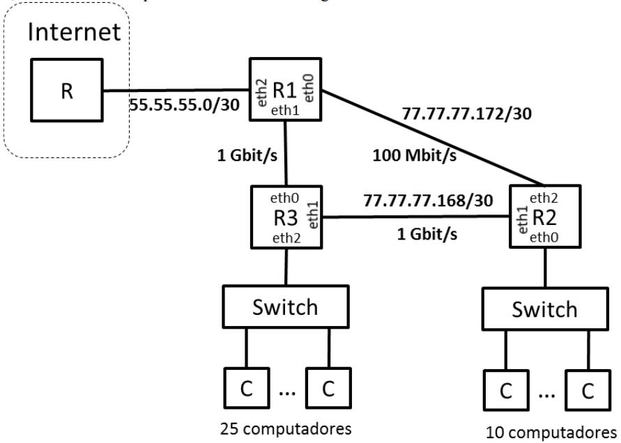

## Exame 2019

### Parte 1

#### Pergunta 1

A camada de rede IP fornece ao protocolo UDP um serviço que
- a) Garante a entrega de todos os pacotes pela sequência correta.
- b) Garante a entrega de todos os pacotes mas não a sua sequência.
- c) Não garante a entrega de todos os pacotes mas garante a sequência dos pacotes entregues.
- d) Não garante a entrega de todos os pacotes nem a sua sequência. :heavy_check_mark:

**Justificação:** IP, por si só, não faz deteção/correção de erros, por isso fornece as mesmas garantias de correção de erros que a camada Data Link: um pacote recebido não tem erros. Assim, não é possivel garantir que o serviço entregue todos os pacotes (um cabo pode ser fisicamente desligado), nem que estejam pela ordem correta (voltar a ligar o cabo).

#### Pergunta 2

Um canal de comunicações do tipo passa-baixo tem uma largura de banda de 2 kHz. Se o débito transmitido nesse canal for de 12 kbit/s estão a ser usados impulsos de
- a) 6 níveis.
- b) 8 níveis. :heavy_check_mark:
- c) 12 níveis.
- d) 64 níveis.

**Resposta:**

C = 12000 bit/s  
B = 2000 Hz  
C = 2B log2(M) <=> M = 2^(C/2B) = 2^(12000/(2*2000)) = 2^(12000/4000) = 2^3 = 8

#### Pergunta 3
Através de um canal de comunicações caracterizado por um Bit Error Ratio (BER) conhecido são transmitidas tramas de dados. Admitamos 2 cenários:

1. Cenário 1 - transmissão de tramas de comprimento L1 bits;
2. Cenário 2 - transmissão de tramas de comprimento L2 =10*L1 bits.

Nesta situação, poderemos afirmar que o Frame Error Ratio do Cenário 1 (FER1) e o Frame Error Ratio do Cenário 2 (FER2) estão relacionados da seguinte forma:

- a) FER1 < FER2. :heavy_check_mark:
- b) FER1 > FER2.
- c) FER1 = FER2.
- d) A informação fornecida não é suficiente para se retirar uma conclusão.

**Justificação:** informalmente, quantos mais bits a trama tiver maior a probabilidade de ter um erro, logo no cenário 2 ocorrerão mais erros do que no cenário 1; assim FER1 < FER2.

Podia-se fazer a análise matemática, a fórmula é FER = 1-(1-BER)^L.

#### Pergunta 4
Os mecanismos ARQ podem ser usados ligação-a-ligação (ARQ-LL) ou extremo-a-extremo (ARQ-EE). Assuma que entre o emissor e o recetor existem N ligações e que as ligações têm um FER elevado. Se quisermos que a rede seja simultaneamente fiável e eficiente deveremos usar
- a) ARQ-LL. :heavy_check_mark:
- b) ARQ-EE.
- c) É irrelevante.
- d) Não deveremos usar nenhum ARQ.

**Justificação:** Ambas as técnicas são igualmente fiáveis, dado que ambas corrigem erros de transmissão. Nesta situação, é melhor utilizar Link-by-Link, dado que permite corrigir erros em cada link; assim a eficiência é S=1-PLR em vez de S=(1-PLR)^N como seria em ARQ-EE. PLR=FER se considerarmos que um pacote com erros pode ser considerado "perdido"

#### Pergunta 5
Considere um mecanismo ARQ Go-Back-N que usa 2 bits para numerar as tramas. Considere também a notação para representação do funcionamento do Emissor em que ?RR(1).!I(1).SW representa a receção (?) da mensagem RR(1) seguida (.) da emissão (!) da mensagem I(1) seguida (.) de uma paragem e espera de confirmação (SW – Stop and Wait). Assumindo que o emissor tem sempre tramas para enviar, o funcionamento do Emissor caracterizado pela sequência de eventos !I(0).?RR(1) poderá ser seguido por
- a) !I(1).!I(2).SW
- b) !I(1).!I(2).!I(3).SW :heavy_check_mark:
- c) !I(1).!I(2).!I(3).!I(0).SW
- d) !I(1).!I(2).!I(3).!I(4).SW

**Justificação:**

k = 2  
W = 3  
O RR(1) significa que todas as mensagens até 0 foram recebidas, assim 0 não é reenviado (exclui c)  
A opção (d) ultrapassa o tamanho da janela, que é 3.  
Quando acaba a sequencia de eventos do enunciado, a janela está vazia, logo não há motivo para só se enviar I(1) e I(2) e logo a seguir parar; o emissor pode enviar mais um frame, e envia de facto I(3)

#### Pergunta 6
Considere duas filas de espera, uma M/M/1 e outra D/D/1, ambas caracterizadas por uma intensidade de tráfego ρ=0,8. Nesta situação
- a) a fila M/M/1 tem um número médio de pacotes N inferior ao da fila D/D/1.
- b) a fila M/M/1 tem um número médio de pacotes N igual ao da fila D/D/1.
- c) a fila M/M/1 tem um número médio de pacotes N superior ao da fila D/D/1. :heavy_check_mark:
- d) É impossível responder porque não são conhecidas as taxas de chegada nem de serviço das filas.

**Justificação:**

Justificação matemática:  
M/M/1: N = ρ/(1-ρ) = 0.8/0.2 = 4.0  
D/D/1: N = ρ = 0.8

Justificação empírica: é óbvio que as condições de M/M/1 (chegada e serviço com distribuições de Poisson) são mais adversas do que as condições de D/D/1 (chegada em intervalos uniformes, serviço em tempo constante).

#### Pergunta 7
Considere a tecnologia de acesso ao meio Carrier Sense Multiple Access/Collision Avoidance (CSMA/CA), o tempo de transmissão de uma trama Tframe e o tempo de propagação de uma trama no meio partilhado Tprop. O CSMA/CA  usa-se em situações em que
- a) Tframe >> Tprop. :heavy_check_mark:
- b) Tframe é aproximadamente igual a Tprop.
- c) Tframe << Tprop.
- d) A sua utilização é independente da relação entre Tframe e Tprop.

**Justificação**: CSMA/CA serve para situações em que é difícil detetar colisões enquanto se envia (por exemplo em WiFi, porque a potência decresce muito rapidamente com a distância). Assim, o transmissor escuta o meio durante um intervalo de tempo DIFS, e se ninguém estiver a transmitir o transmissor assume que não há ninguém a querer transmitir e transmite ele. Serve principalmente quando Tframe >> Tprop porque, se Tframe for da mesma ordem de grandeza de Tprop, vão haver muitas frames pequenas para transmitir, e por cada frame um transmissor tem que esperar durante DIFS segundos, logo se houver muitas frames existe muito tempo inútil que é gasto a verificar se ninguém está a transmitir.

#### Pergunta 8
A tabela NAT de um router tem a seguinte entrada <(140.76.29.6, 80),(172.16.1.4, 8080)>. A rede privada tem o endereço 172.16.0.0/16 e existe um servidor HTTP na porta 8080 da máquina com o endereço 172.16.1.4. A interface do router na rede pública tem o endereço MAC AA::AA. A interface do servidor HTTP tem o endereço MAC BB::BB. Nesta situação, os endereços IP e MAC de origem de uma trama observada na rede pública proveniente deste servidor são os seguintes
- a) IPorig=140.76.29.6, MACorig= AA::AA. :heavy_check_mark:
- b) IPorig=140.76.29.6, MACorig= BB::BB.
- c) IPorig=172.16.1.4, MACorig= AA::AA.
- d) IPorig=172.16.1.4, MACorig= BB:BB.

**Justificação:** Se uma das funções de NAT é esconder os IPs da rede privada, não faria sentido os pacotes que saem do router para a rede pública terem IPs do lado interior da rede (sendo que o endereço 172.16.1.4 do router, que é o interface privado, também pertence à rede privada). Assim, na rede pública o IP de origem é 140.76.29.6, que é o IP público do router.

Se o objetivo continua a ser esconder, não faz sentido irem MAC addresses da rede privada em pacotes que vão para a rede pública; além disso, quem decide para que estação da rede privada é que vai uma resposta da rede pública é o router, por isso o router guarda os MAC addresses da rede privada, e nos pedidos públicos envia o seu MAC address e IP públicos, junto geralmente com um número de porta para depois fazer match do número de porta para o MAC address da rede privada correto.

#### Pergunta 9

O valor da janela de congestionamento de uma ligação TCP
- a) é calculado pelo emissor e mantém-se constante durante uma ligação TCP.
- b) é calculado pelo emissor e pode variar durante uma ligação TCP. :heavy_check_mark:
- c) é calculado pelo recetor, enviado por este ao emissor no campo Window Size da mensagem de ACK e mantém-se constante durante uma a ligação TCP.
- d) é calculado pelo recetor, enviado por este ao emissor no campo Window Size da mensagem de ACK e pode variar durante uma ligação TCP.

**Justificação:** A janela de congestionamento, `CWND`, é calculada e mantida apenas pelo emissor, e pode variar dependendo de alterações na configuração da rede ou na carga sobre a rede.

#### Pergunta 10

No protocolo FTP, em resposta ao pedido de transferência de dados em modo passivo, o servidor envia ao cliente
- a) O endereço da porta do cliente para a ligação de controlo.
- b) O endereço da porta do cliente para a ligação de dados.
- c) O endereço da porta do servidor para a ligação de controlo.
- d) O endereço da porta do servidor para a ligação de dados. :heavy_check_mark:

**Justificação:** O servidor não sabe como funciona o client, por isso envia o endereço de porta de si próprio. Para colocar em modo passivo já é preciso ter uma ligação de controlo, logo obviamente a nova ligação será de dados.

### Parte 2

#### Pergunta 1
Duas estações comunicam usando uma ligação de dados baseada em mecanismos ARQ. A capacidade do canal é de 800 kbit/s, o atraso de propagação (num sentido) é de 20 ms e as tramas de Informação têm um tamanho fixo de 1000 octetos. Considere que são usados 2 bits para numerar as tramas de Informação e que as tramas de controlo têm um tamanho desprezável.

##### Item (a)

Calcule a eficiência máxima do protocolo para as variantes Stop and Wait, Go Back N e Selective Repeat. Calcule também os débitos máximos correspondentes.

**Resposta:**

|                        | Stop and Wait | Go Back N | Selective Repeat |
|------------------------|---------------|-----------|------------------|
| Eficiência máxima (%)  | 20            | 60        | 40               |
| Débito máximo (kbit/s) | 160           | 480       | 320              |

k = 2  
M = 4  
C = 800 kbit/s = 8e5 bit/s  
Tprop = 0.020 s  
L = 8000 bit  
Tf = L/C = 8000 bit / 8e5 bit/s = 0.01 s  
a = Tprop/Tf = 0.020 s / 0.010 s = 2  

| Stop and Wait       | Go Back N           | Selective Repeat    |
|---------------------|---------------------|---------------------|
|                     | W = M-1 = 3         | W = M/2 = 2         |
| S = 1/(1+2a) = 0.20 | S = W/(1+2a) = 0.60 | S = W/(1+2a) = 0.40 |

Debito = C*S

| Stop and Wait       | Go Back N           | Selective Repeat    |
|---------------------|---------------------|---------------------|
| Debito = 160 kbit/s | Debito = 480 kbit/s | Debito = 320 kbit/s |

##### Item (b)

Pretende-se analisar o efeito dos erros de transmissão e do tamanho das tramas de Informação. Considere tramas com tamanhos 1000 e 2000 octetos e uma situação de ruído caracterizada por Bit Error Ratio BER=10^(-4). Calcule a eficiência máxima dos três mecanismos para estes casos e discuta o comportamento destes mecanismos face ao aumento do tamanho das tramas

Nota de resolução:
- Comprimentos L diferentes originam FER's diferentes, Tframe's diferentes e a's diferentes

**Resposta:**

| Smax (%)         | Stop and Wait | Go Back N | Selective Repeat |
|------------------|---------------|-----------|------------------|
| L = 1000 octetos |  8.99         | 12.83     | 17.97            |
| L = 2000 octetos |  6.73         |  7.78     | 13.46            |

k = 2  
M = 4  
C = 800 kbit/s = 8e5 bit/s  
Tprop = 0.020 s  

L = 1000B:  
Tf = L/C = 8000 bit / 8e5 bit/s = 0.01 s
a = Tprop/Tf = 0.020 s / 0.010 s = 2
pe = 1-(1-BER)^(L/bit) = 1-(1-10^(-4))^8000 = 0.55069

| Stop and Wait              | Go Back N                                 | Selective Repeat            |
|----------------------------|-------------------------------------------|-----------------------------|
|                            | W = M-1 = 3                               | W = M/2 = 2                 |
| S = (1-pe)/(1+2a) = 0.0899 | S = W(1-pe)/((1+2a)(1-pe+W\*pe)) = 0.1283 | S = W(1-pe)/(1+2a) = 0.1797 |

L = 2000B:  
Tf = L/C = 16000 bit / 8e5 bit/s = 0.02 s
a = Tprop/Tf = 0.020 s / 0.020 s = 1
pe = 1-(1-BER)^(L/bit) = 1-(1-10^(-4))^16000 = 0.79812

| Stop and Wait              | Go Back N                                 | Selective Repeat            |
|----------------------------|-------------------------------------------|-----------------------------|
|                            | W = M-1 = 3                               | W = M/2 = 2                 |
| S = (1-pe)/(1+2a) = 0.0673 | S = W(1-pe)/((1+2a)(1-pe+W\*pe)) = 0.0778 | S = W(1-pe)/(1+2a) = 0.1346 |

##### Item (c)

Suponha que se pretendia fazer uma ligação para um satélite localizado a 30 000 km de altitude com um débito de 100 kbit/s. Para a eficiência máxima, tramas de 1000 octetos e transmissão feita num canal de 20kHz, qual seria número mínimo de bits necessários para numerar as tramas e qual seria a relação sinal-ruído (SNR – Signal to Noise Ratio) necessária no recetor, em dB. A velocidade da luz é de 3*10^8 m/s.

Notas de resolução:
- Se SNR for elevado, BER~0 e FER~0
- GBN e SR podem atingir eficiências S=1 se W >= 1+2a
- Sendo Débito= S*Capacidade, se S=1 então Capacidade = Débito
- A lei de Shannon dá-nos a capacidade máxima de um canal sem erros, atingível pelas tecnologias mais recentes: C= Bc log2 (1+SNR); neste caso Bc= 20 kHz
- SNRdB= 10 log10(SNR)

**Resposta:**

|                   |      |
|-------------------|------|
| Número de bits, k | 3    |
| SNR (dB)          | 14.9 |

d = 3e7 m
Debito = 100000 bit/s  
L = 8000 bit
B = 20000 Hz
c = 3e8 m/s
Tprop = d/c = 0.100 s
Tf = L/C = 0.080 s
a = Tprop/Tf = 1.25

Vamos escolher o menor número de bits que permita obter a eficiência máxima; ou seja, escolher k tal que W ≥ 1+2a.  
W = 1+2a = 3.5  
GBN: k = 3 => W = 2^3-1 = 7, logo k=3 chega  
SR: k = 3 => W = 2^(3-1) = 4, logo k=3 chega

Assuma-se que SNR é elevado. Logo, BER~0 e FER~0. Assim, GBN e SR dão S = 1.

Assim, C = Debito = 100000 bit/s

Pela lei de Shannon,

C = B log2(1+SNR) <=> SNR = 2^(C/B)-1 = 2^(100000 bit/s / 20000 Hz)-1 = 2^5-1 = 32-1 = 31

SNR/dB = 10 log10(SNR) = 10*1.49 = 14.9

#### Pergunta 2

Através de uma porta de saída de um comutador de tramas é encaminhado tráfego recebido em 8 portas de entrada. Admita que a porta de saída tem uma capacidade de 100 Mbit/s e que todas as portas de entrada contribuem com fluxos de tráfego iguais.

##### Item (a)
Admitindo que poderemos usar uma fila M/M/1 para modelizar a porta de saída e que as tramas têm um comprimento médio de 500 Bytes, calcule o débito máximo de cada fluxo de entrada para que a porta de saída tenha uma utilização inferior a 90%. Calcule também o tempo médio de espera dos pacotes (Tw) e a ocupação média da fila de espera (Nw).

**Resposta:**

|                                               |       |
|-----------------------------------------------|-------|
| Débito de fluxo na porta de entrada, (Mbit/s) | 11.25 |
| Tempo médio de atraso dos pacotes, Tw, (μs)   | 360   |
| Ocupação média da fila de espera, Nw          | 8.1   |

L = 4000 bit
μ = 100 Mbit/s = 25000 pac/s  
ρ = 0.90
ρ = λ/μ <=> λ = ρμ = 0.90 * 100 Mbit/s = 90 Mbit/s

90 Mbit/s / 8 = 11.25 Mbit/s

Tw = ρ/(μ(1-ρ)) = 0.00036 s = 360 μs

Nw = Tw\*λ = (360 μs)\*(90 Mbit/s) = (360 μs)\*(0.0225 pac/μs) = 8.1 pac

##### Item (b)

Admita agora que a fila de espera é finita. Calcule o número mínimo de buffers B associados à fila de espera para que a probabilidade de perda de pacotes seja inferior a 1% nas duas situação seguintes:

1. o tráfego de entrada total é igual a 90% da capacidade da porta de saída;
2. o tráfego de entrada total é igual à capacidade da porta de saída.

| ---          | Situação (i) | Situação (ii) |
|--------------|--------------|---------------|
| Nº buffers B | 23           | 99            |

P(B) = 0.01  

| Situação (i)                | Situação (ii)                                     |
|-----------------------------|---------------------------------------------------|
| ρ = 0.9                     | ρ = 1.0                                           |
| P(B) = ρ^B(1-ρ)/(1-ρ^(B+1)) | P(B) = 1/(B+1) <=> B = (1/P(B))-1 = 1/0.01-1 = 99 |
| B = 23                      |                                                   |

##### Item (c)

Admita que o tráfego de entrada da alínea a) duplicava e que as tramas passavam a ter comprimento constante. Para suportar este tráfego pretende-se estudar duas situações alternativas:

1. duplicar a capacidade da porta de saída;
2. constituir duas VLANs de 4 portas de entradas cada, associando a cada VLAN uma porta de saída de capacidade de 100 Mbit/s.

Para estas duas situações, calcule o tempo médio de atraso do pacotes (T) e a ocupação média da fila (N). Indique, justificando, qual das duas soluções lhe parece ser a melhor.

**Resposta:**

|                                              | Situação (i) | Situação (ii) |
|----------------------------------------------|--------------|---------------|
| Tempo médio de atraso dos pacotes, T, (μs)   | 110          | 220           |
| Ocupação média da fila de espera, N          | 4.95         | 4.95          |

L = 4000 bit  
λ = 180 Mbit/s = 45000 pac/s  

| Situação (i)                                  | Situação (ii)                                             |
|-----------------------------------------------|-----------------------------------------------------------|
| μ = 200 Mbit/s = 50000 pac/s                  | μ = 100 Mbit/s = 25000 pac/s, λ = 90 Mbit/s = 22500 pac/s |
| ρ = λ/μ = 0.90                                | ρ = λ/μ = 0.90                                            |
| Tw = ρ/(2μ(1-ρ)) = 0.00009 s                  | Tw = ρ/(2μ(1-ρ)) = 0.00018 s                              |
| T = Tw+1/μ = 0.00011 s = 110 μs               | T = Tw+1/μ = 0.00022 s = 220 μs                           |
| N = λT = 4.95 pac                             | N = λT = 4.95 pac                                         |

As duas opções possuem a mesma ocupação média da fila de espera, que é relativamente pequena e por isso não serve de desempate.  
Já o tempo médio de atraso dos pacotes na situação (i) é metade da situação (ii), o que significa que o lag provocado pelo comutador é menor na situação (i). Assim, escolheria a situação (i), por permitir ter metade do lag.

#### Pergunta 3

Considere que a uma empresa foi atribuído o bloco de endereços IP 77.77.77.128/26. A empresa tem uma rede de comunicações com a arquitetura descrita na figura, composta por 3 routers (R1, R2, R3) e 2 switches Ethernet. Um dos switches serve 25 computadores e outro serve 10 computadores. Os routers estão interligados por ligações ponto-a-ponto e a algumas destas ligações estão já atribuídos os endereços indicados na figura. As ligações entre os routers R1, R2 e R3 têm as capacidades indicadas nas figura.

##### Item (a)

Calcule os endereços associados às redes indicadas. A endereço da rede da ligação R1-R3 deverá ser o mais baixo possível.

**Resposta:**
<!--
|                          | Endereço da subrede (endereço/máscara) | Endereço de broadcast da subrede | Nº de endereços de interfaces |
|--------------------------|----------------------------------------|----------------------------------|-------------------------------|
| Rede dos 25 computadores | 77.77.77.10?00000/27                   | 77.77.77.10?11111                | 30                            |
| Rede dos 10 computadores | 77.77.77.10??0000/28                   | 77.77.77.10??1111                | 14                            |
| Rede da ligação R1-R3    | 77.77.77.10????00/30                   | 77.77.77.10????11                | 2                             |

A rede de 25C tem que ser 77.77.77.10000000, senão seria 77.77.77.10100000, o que significaria que as redes 77.77.77.172/30 e 77.77.77.168/30 "retirariam" cada uma 4 endereços a 77.77.77.10000000, o que significaria que a rede de 25C, que tinha inicialmente 32 IPs, passaria a ter 24; menos o endereço de rede e broadcast, 22, o que não chegaria para atribuir IPs aos 25 computadores.

|                          | Endereço da subrede (endereço/máscara) | Endereço de broadcast da subrede | Nº de endereços de interfaces |
|--------------------------|----------------------------------------|----------------------------------|-------------------------------|
| Rede dos 25 computadores | 77.77.77.10000000/27                   | 77.77.77.10?11111                | 30                            |
| Rede dos 10 computadores | 77.77.77.10??0000/28                   | 77.77.77.10??1111                | 14                            |
| Rede da ligação R1-R3    | 77.77.77.10????00/30                   | 77.77.77.10????11                | 2                             |

O ultimo octeto das outras duas redes têm assim que começar em 101, para não retirarem IPs à rede de 25C

|                          | Endereço da subrede (endereço/máscara) | Endereço de broadcast da subrede | Nº de endereços de interfaces |
|--------------------------|----------------------------------------|----------------------------------|-------------------------------|
| Rede dos 25 computadores | 77.77.77.10000000/27                   | 77.77.77.10?11111                | 30                            |
| Rede dos 10 computadores | 77.77.77.101?0000/28                   | 77.77.77.10??1111                | 14                            |
| Rede da ligação R1-R3    | 77.77.77.101???00/30                   | 77.77.77.10????11                | 2                             |

Para as 2a rede não sere "roubadas" pelas duas ligações de router, o ultimo octeto tem que começar por 1011

|                          | Endereço da subrede (endereço/máscara) | Endereço de broadcast da subrede | Nº de endereços de interfaces |
|--------------------------|----------------------------------------|----------------------------------|-------------------------------|
| Rede dos 25 computadores | 77.77.77.10000000/27                   | 77.77.77.10?11111                | 30                            |
| Rede dos 10 computadores | 77.77.77.10110000/28                   | 77.77.77.10??1111                | 14                            |
| Rede da ligação R1-R3    | 77.77.77.101???00/30                   | 77.77.77.10????11                | 2                             |

Só falta a ultima rede. Podemos escolher quatro opções: 10100000, 10100100, 10101000, 10101100. 10101000 e 10101100 estão tomadas pelas outras ligações entre routers, sobrando assim 10100000, 10100100. A menos é 10100000, logo escolhemos essa

|                          | Endereço da subrede (endereço/máscara) | Endereço de broadcast da subrede | Nº de endereços de interfaces |
|--------------------------|----------------------------------------|----------------------------------|-------------------------------|
| Rede dos 25 computadores | 77.77.77.10000000/27                   | 77.77.77.10011111                | 30                            |
| Rede dos 10 computadores | 77.77.77.10110000/28                   | 77.77.77.10111111                | 14                            |
| Rede da ligação R1-R3    | 77.77.77.10100000/30                   | 77.77.77.10100011                | 2                             |
-->

|                          | Endereço da subrede (endereço/máscara) | Endereço de broadcast da subrede | Nº de endereços de interfaces |
|--------------------------|----------------------------------------|----------------------------------|-------------------------------|
| Rede dos 25 computadores | 77.77.77.128/27                        | 77.77.77.159                     | 30                            |
| Rede dos 10 computadores | 77.77.77.176/28                        | 77.77.77.191                     | 14                            |
| Rede da ligação R1-R3    | 77.77.77.160/30                        | 77.77.77.163                     | 2                             |

##### Item (b)

Atribua endereços IP às interfaces de rede indicadas na tabela. Use os endereços mais baixos de cada subrede. Numa sub-rede atribua os endereço mais baixo ao routers de índice Ri mais baixo. Por exemplo, o endereço de R1.eth0 deverá ser inferior ao endereço R2.eth2.

| Interface Router | Endereço IP  |
|------------------|--------------|
| R1.eth0          | 77.77.77.173 |
| R2.eth2          | 77.77.77.174 |
| R2.eth0          | 77.77.77.177 |
| R2.eth1          | 77.77.77.169 |
| R3.eth1          | 77.77.77.170 |

##### Item (c)

Escreva a tabela de encaminhamento do router R2. Este router deverá ser capaz enviar pacotes para todos os endereços IP unicast e os pacotes deverão ser encaminhados pelos caminhos de custo mais baixo. Assuma que o custo de uma ligação é o inverso (1/x) da sua capacidade; por exemplo, a ligação com capacidade de 1 Gbit s tem um custo de 10^(-9). Use o menor número possível de entradas na tabela.

| Destino (endereço/máscara) | Gateway      | Interface |
|----------------------------|--------------|-----------|
| 77.77.77.176/28            | -            | eth0      |
| 77.77.77.172/30            | -            | eth2      |
| 77.77.77.168/30            | -            | eth2      |
| 0/0                        | 77.77.77.170 | eth1      |
