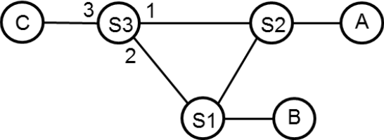
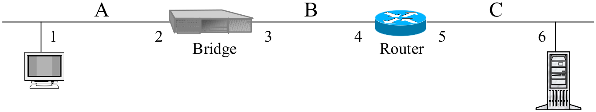
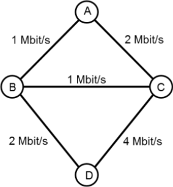
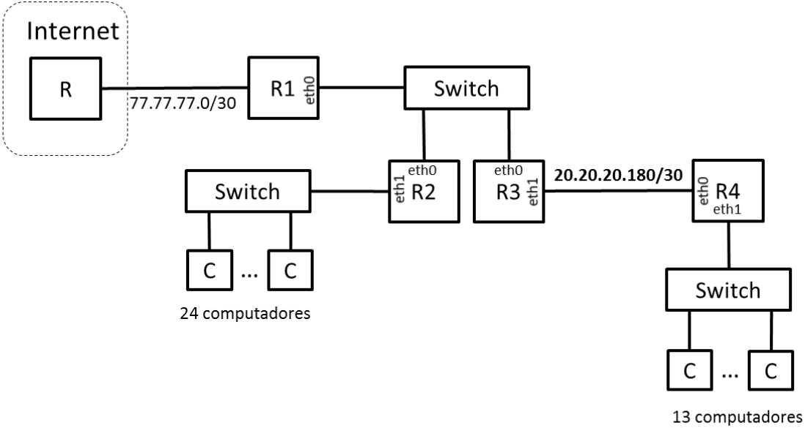

## Recurso 2018

### Parte 1

#### Pergunta 1
Se numa transmissão de dados for usada para uma modulação 16QAM (constelação de 16 pontos) e for observado um débito binário de 8 kbit/s então o débito de símbolos desta ligação é de
- a) 500 baud.
- b) 2 kbaud. :heavy_check_mark:
- c) 8 kbaud.
- d) 32 kbaud.

**Justificação:** Nyquist bitrate: C = fs log2(M) <=> fs = C/log2(M) = 8000 bit/s / log2(16) = 2000 baud = 2 kbaud.

#### Pergunta 2
O protocolo de Transporte UDP (User Datagram Protocol) oferece às Aplicações que o usam:
- a) Um serviço fiável orientado às ligações.
- b) Um serviço fiável não orientado às ligações.
- c) Um serviço não fiável orientado às ligações.
- d) Um serviço não fiável não orientado às ligações. :heavy_check_mark:

#### Pergunta 3
O envio de tramas de dados delimitadas por FLAGs com o valor FLAG=0x7E impõe a utilização de técnicas de stuffing. No processo de transmissão dos dados, a técnica de byte stuffing substitui no interior da trama
- a) FLAG por ESC FLAG. :heavy_check_mark:
- b) FLAG por FLAG ESC.
- c) 11111 por 111110.
- d) 111111 por 1111110

#### Pergunta 4
Considere o mecanismo ARQ Go-Back-N a funcionar com uma janela W=63. Considere também uma notação para representação do funcionamento do Recetor em que ?I(0).!RR(1) representa a receção (?) da mensagem I(0) seguida (.) do envio (!) da mensagem RR(1). O funcionamento do Recetor descrito pela sequência de eventos ?I(0).!RR(1).?I(1).?I(2).?I(4) poderá ser seguido por
- a) !REJ(3).?I(5).?I(3).!RR(6)
- b) !REJ(3).?I(5).?I(3).!RR(4) :heavy_check_mark:
- c) !REJ(3).?I(5).!REJ(3).?I(3).!RR(6)
- d) !REJ(3).?I(5).!REJ(3).?I(3).!RR(4)

**Justificação:** Depois de receber I(2), o recetor fica à espera de I(3); ao receber I(4) (fora de ordem), o recetor envia REJ(3) para rejeitar e avisar que quer a frame com numero de sequencia 3. Ao receber I(5), discarta silenciosamente. Ao receber I(3), dá RR(4) (acknowledge até mas excluindo 4), logo é impossível RR(6) se ainda nem recebeu corretamente I(4) ou I(5).

#### Pergunta 5
Considere um meio partilhado por um conjunto de computadores. Assuma que a maior distância entre dois computadores é L [m] e que a informação se propaga no meio com uma velocidade S [m/s]. Assuma ainda que os computadores acedem ao meio usando o protocolo CSMA/CD (Collision Detection). Nesta situação, o tempo de transmissão T [s] de uma trama deve satisfazer a seguinte condição
- a) T < L/S
- b) L/S < T < 2L/S
- c) T > 2L/S :heavy_check_mark:
- d) Nenhuma das anteriores.

**Justificação:** Para garantir que todas as estações detetam a colisão se ela existir, as frames têm que demorar tanto ou mais tempo a transmitir (Tf) do que o RTT, porque A pode começar a transmitir, B começar a transmitir um bocadinho antes de lhe chegar o sinal de A, mas quando o sinal de B chegar a A (para A se aperceber da colisão), A já vai ter acabado a transmissão e não se apercebe da colisão.

#### Pergunta 6

Considere a rede da figura constituída pelos comutadores Ethernet S1, S2 e S3 que executam o Spanning Tree Protocol (SPT) em que o identificador de Si é i . A esta rede encontram-se ligados os computadores A, B e C. Assumindo que as tabelas de encaminhamento dos comutadores estão inicialmente vazias e que ocorrem as transmissões (1) A envia para B, (2) B envia para A, (3) A envia para C, a tabela de encaminhamento do comutador S3 é constituída pelas seguintes entradas (endereço, porta)
- a) (A,1), (B,2).
- b) (A,1), (B,2), (C,3).
- c) (A,2). :heavy_check_mark:
- d) (A,2), (B,2).

**Justificação:**

A spanning tree tem raiz em S1, e é constituída por S1-S2, S1-S3 (logo S2-S3 é bloqueado).

A->B: segue caminho A->S2->S1->B, logo S3 não faz ideia do que está a acontecer.  
B->A: segue caminho B->S1->S2->A, logo S3 não faz ideia do que está a acontecer.  
A->C: segue caminho A->S2->S1->S3->C, logo S3 associa o endereço de A à porta 2.

#### Pergunta 7

Assuma que um computador se liga à rede e pretende obter o seu endereço IP através de DHCP. Na primeira mensagem enviada pelo computador (DHCP Discover) os endereços de origem e destino são:
- a) Origem= 0.0.0.0, Destino=0.0.0.0
- b) Origem= 0.0.0.0, Destino=255.255.255.255 :heavy_check_mark:
- c) Origem= 255.255.255.255, Destino=0.0.0.0
- d) Origem= 255.255.255.255, Destino=255.255.255.255

**Justificação:** A origem é 0.0.0.0 porque o computador ainda não tem endereço IP, então usa 0.0.0.0 que costuma ser convencionado como IP inválido/inexistente.

O destino é o broadcast local 255.255.255.255, porque o computador não sabe os IPs dos servidores DNS na subnet local (nem sabe se existem servidores DNS), por isso é que se chama um pedido DISCOVER.

#### Pergunta 8

O valor da janela de congestionamento de uma ligação TCP é calculado pelo
- a) emissor e mantém-se constante durante uma ligação TCP.
- b) emissor e pode variar durante uma ligação TCP. :heavy_check_mark:
- c) recetor, enviado por este ao emissor no campo Window Size da mensagem de ACK e mantém-se constante durante uma a ligação TCP.
- d) recetor, enviado por este ao emissor no campo Window Size da mensagem de ACK e pode variar durante uma ligação TCP.

**Justificação:** A janela de congestionamento da ligação TCP não é anunciada, é apenas mantida pelo emissor. O emissor pode (e deve) alterar a janela de congestionamento para ter em conta a dinâmica da rede (carga variável sobre a rede, alteração da topologia), senão não tinha grande utilidade a janela de congestionamento.

#### Pergunta 9
Na figura seguinte, se o computador do segmento C fizer ping ao Computador do segmento A, indique os endereços IP e MAC constantes do pacote que transporta a mensagem ICMP Echo Request no segmento A.

- a) IPorig=4, IPdest=1, MACorig=2, MACdest=1.
- b) IPorig=4, IPdest=1, MACorig=4, MACdest=1.
- c) IPorig=6, IPdest=1, MACorig=2, MACdest=1.
- d) IPorig=6, IPdest=1, MACorig=4, MACdest=1. :heavy_check_mark:

#### Pergunta 10

Se na rede da figura o custo de cada ligação for igual ao tempo de transmissão de um pacote através dessa ligação e se for usado um protocolo de rotas do tipo link-state, então o débito máximo possível de A para D é
- a) 1 Mbit/s.
- b) 2 Mbit/s. :heavy_check_mark:
- c) 3 Mbit/s
- d) 6 Mbit/s

### Parte 2

#### Pergunta 1
Duas estações comunicam usando uma ligação de dados baseada em mecanismos ARQ. A capacidade do canal é de 400 kbit/s, o atraso de propagação (num sentido) é de 50 ms e as tramas de Informação têm um tamanho fixo de 200 octetos. Considere que são usados 3 bits para numerar as tramas de Informação e que as tramas de controlo têm um tamanho desprezável.

##### Item (a)
Calcule a eficiência máxima do protocolo para as variantes Stop and Wait, Go Back N e Selective Repeat. Calcule também os débitos máximos correspondentes.

|                           | Stop and Wait | Go Back N | Selective Repeat  |
|---------------------------|---------------|-----------|-------------------|
| Eficiência máxima (%)     | 3.85          | 26.92     | 15.38             |
| Débito máximo (kbit/s)    | 15.4          | 107.7     | 61.5              |

**Justificação:**

Tprop = 50 ms = 0.050 s  
L = 200 B = 1600 bit  
C = 400 kbit/s = 250 pac/s  
k = 3  
M = 8  
Tf = 1/C = 0.004 s  
a = Tprop/Tf = 0.050 s / 0.004 s = 12.5  

Debito = C*S

| Stop and Wait                 | Go Back N                             | Selective Repeat              |
|-------------------------------|---------------------------------------|-------------------------------|
|                               | W = M-1 = 7                           | W = M/2 = 4                   |
|                               | W < 1+2a <=> 7 < 26                   | W < 1+2a <=> 4 < 26           |
| S = (1-pe)/(1+2a) = 0.0385    | S = W(1-pe)/(1+2a)(1-pe+Wpe) = 0.2692 | S = W(1-pe)/(1+2a) = 0.1538   |
| Debito = 15.4 kbit/s          | Debito = 107.7 kbit/s                 | Debito = 61.5 kbit/s          |

##### Item (b)

Suponha que o emissor tem um bloco de 20 kbit de dados para transmitir a pedido da camada de rede. Desprezando os overheads introduzidos pelo protocolo de ligação lógica, calcule para cada variante ARQ o tempo necessário para o envio do bloco de dados (até ser recebida a última confirmação) e o débito observado pela camada superior. Assuma que todas as tramas recebidas pelo recetor são confirmadas. Se necessário recorra a diagramas.

|                                   | Stop and Wait     | Go Back N     | Selective Repeat  |
|-----------------------------------|-------------------|---------------|-------------------|
| Tempo de envio do bloco (ms)      | 1350              | 222           | 414               |
| Débito observado (kbit/s)         | 14.8              | 90            | 48                |

**Justificação:**

20kbit = 20 000 bit, que são 20 000 bit / 1600 bit = 12.5; logo são 13 pacotes.

Stop & Wait: 12.5\*Tf + 13\*RTT = 12.5\*Tf + 26\*Tprop = 1.35 s = 1350 ms  
Go Back N: 222ms
Selective Repeat: 414 ms

##### Item (c)

Considere que era utilizado o mecanismo do tipo Selective Repeat numa situação de erro caracterizada por um BER=10^-4. Que janela (W) e quantos bits de numeração (K) escolheria para obter a utilização máxima teórica do canal? Qual seria a utilização máxima do canal nessa situação?

| Parâmetro                 | Valor       |
|---------------------------|-------------|
| W                         | 26          |
| K                         | 6           |
| Utilização máxima (%)     | 85.21       |

**Justificação:**

L = 1600 bit  
pe = FER = 1-(1-BER)^(L/bit) = 0.1479

A eficiência máxima é Smax = 1-pe = 0.8521, e é obtida com W ≥ 1+2a.

W = 1+2a <=> W = 26

M = 64  
k = 6  

#### Pergunta 2
Admita que a porta de saída de um router é modelizada por uma fila de espera M/M/1 de capacidade infinita. Observa-se que em média são transmitidos através desta porta 60 pac/s de comprimento médio de 1500 bytes; a linha associada à porta encontra-se em transmissão cerca de 50% do tempo.

##### Item (a)
Calcule a capacidade de transmissão da porta de saída do router, o tempo médio de atraso dos pacotes e a ocupação média da fila de espera da porta.

|                                                       |           |
|-------------------------------------------------------|-----------|
| Capacidade de transmissão da porta (kbit/s)           | 1440      |
| Tempo médio de atraso dos pacotes, T, (ms)            | 16.667    |
| Ocupação média da fila de espera, Nw                  | 0.5       |

**Justificação:**

L = 1500 B = 12000 bit  
λ = 60 pac/s = 720 000 bit/s  
ρ = 0.50  

ρ = λ/μ <=> μ = λ/ρ = 60 pac/s / 0.5 = 120 pac/s = 1 440 000 bit/s = 1440 kbit/s

T = 1/(μ-λ) = 1/(120 pac/s - 60 pac/s) = 0.016667 s = 16.667 ms

Nw = N-ρ = ρ/(1-ρ) - ρ = 0.5

##### Item (b)
Admita que para o mesmo tráfego transportado pelo sistema (em bit/s) os pacotes passavam, em situações diferentes, a ter um comprimento médio respetivamente de L1=750 bytes e L2= 3000 bytes. Para estas duas situações calcule o atraso médio dos pacotes (T) e a ocupação média da fila de espera (N w). Indique justificando qual das duas situações parece ser a melhor.

|                                       | Situação 1    | Situação 2    |
|---------------------------------------|---------------|---------------|
| Atraso médio dos pacotes, T (ms)      | 8.333         | 33.333        |
| Ocupação média da fila de espera, Nw  | 0.5           | 0.5           |

**Justificação:**

λ = 720 000 bit/s

| Situação 1                                        | Situação 2                                        |
|---------------------------------------------------|---------------------------------------------------|
| L = 750 B = 6000 bit                              | L = 3000 B = 24 000 bit                           |
| λ =   720 000 bit/s = 120 pac/s                   | λ =   120 000 bit/s = 30 pac/s                    |
| μ = 1 440 000 bit/s = 240 pac/s                   | μ = 1 440 000 bit/s = 60 pac/s                    |
| T = 1/(μ-λ) = 1/(240-120) = 0.008333 s = 8.333 ms | T = 1/(μ-λ) = 1/(60-30) = 0.033333 s = 33.333 ms  |

ρ continua a ser 0.5, logo mantém-se a ocupação da fila de 0.5.

A melhor opção é a situação 1, dado que ambas as situações possuem a mesma ocupação média da fila de espera (logo ocupam a mesma quantidade média de recursos para a fila), mas a situação 1 tem menos atraso (8ms contra 33ms).

##### Item (c)
Admita agora que os pacotes passam a ter um tamanho constante de 1500 bytes, que a linha tem um comprimento de 200 km, que a informação de propaga nessa linha com um atraso de 5µs/km e que, no outro extremo dessa linha, se encontra um segundo router modelizavel também por uma fila de espera e que transmite informação a 100 Mbit/s. Calcule o atraso médio dos pacotes na fila do primeiro router (T1), o atraso médio dos pacotes na fila do segundo router (T2), e o atraso médio total dos pacotes neste sistema (T total). No caso de não ter resolvido as alíneas anteriores assuma que o débito de transmissão da porta do primeiro router é de 1 Mbit/s.

| T1 (ms)               | T2 (ms)           | Ttotal (ms)           |
|-----------------------|-------------------|-----------------------|
| 12.5                  | 0.12              | 13.62                 |

**Justificação:**

Fila M/D/1

L = 1500 B = 12000 bit  
D = 200 km  
Atraso = 5µs/km = 0.000005 s/km  
Tprop = D*Atraso = 0.001 s = 1 ms  

μ1 = 1 440 000 bit/s = 120 pac/s   
λ1 = λ2 =   720 000 bit/s =  60 pac/s  
ρ1 = 0.5  

T1 = Tw1 + 1/μ1 = ρ1/(2\*μ1(1-ρ1)) + 1/μ1 = 0.0125 s = 12.5 ms

μ2 = 100 Mbit/s = 100 000 000 bit/s = 8333.3 pac/s

O router 2 é uma fila em que não vai haver esperas: T2 = Tf = 0.00012 s = 0.12 ms

#### Pergunta 3
Considere que a uma empresa foi atribuído o bloco de endereços IP 20.20.20.128/26. A empresa tem um rede de comunicações com a arquitetura descrita na figura, composta por 4 routers (R1, R2, R3, R4) e 3 switches Ethernet. Um dos switches serve 24 computadores, outro serve 13 computadores e o terceiro interliga os routers R1, R2 e R3. Os routers R3 e R4 estão interligados por uma ligação ponto-a-ponto, à qual foi atribuído o endereço de rede 20.20.20.180/30.

##### Item (a)
Calcule os endereços de rede associados às redes indicadas.

|                               | Endereço da subrede (endereço/máscara)    | Endereço de broadcast da subrede  | Nº de endereços de interfaces     |
|-------------------------------|-------------------------------------------|-----------------------------------|-----------------------------------|
| Rede dos 24 computadores      | 20.20.20.128/27                           | 20.20.20.159                      | 30                                |
| Rede dos 13 computadores      | 20.20.20.160/28                           | 20.20.20.175                      | 14                                |
| Rede dos routers R1, R2 e R3  | 20.20.20.184/29                           | 20.20.20.191                      | 6                                 |

##### Item (b)
Atribua endereços IP às interfaces dos routers R1, R2, R3 e R4. Use os endereços mais baixos de cada subrede. Numa sub-rede atribua os endereços mais baixos aos routers de índice Ri mais baixo. Por exemplo, o endereço de R3.eth1 deverá ser inferior ao endereço R4.eth0.

| Router.interface  | Endereço(s) IP    |
|-------------------|-------------------|
| R1.eth0           | 20.20.20.185      |
| R2.eth0           | 20.20.20.186      |
| R2.eth1           | 20.20.20.129      |
| R3.eth0           | 20.20.20.187      |
| R3.eth1           | 20.20.20.181      |
| R4.eth0           | 20.20.20.182      |
| R4.eth1           | 20.20.20.161      |

##### Item (c)

(Use as linhas que for necessário)

Escreva a tabela de encaminhamento do router R2. Este router deverá ser capaz enviar pacotes para todos os endereços IP unicast. Use o menor número possível de entradas na tabela.

| Destino (endereço/máscara)    | Gateway       | Interface |
|-------------------------------|---------------|-----------|
| 20.20.20.128/27               | -             | eth1      |
| 20.20.20.184/28               | -             | eth0      |
| 20.20.20.180/30               | 20.20.20.187  | eth0      |
| 20.20.20.160/28               | 20.20.20.187  | eth0      |
| 0/0                           | 20.20.20.185  | eth0      |
