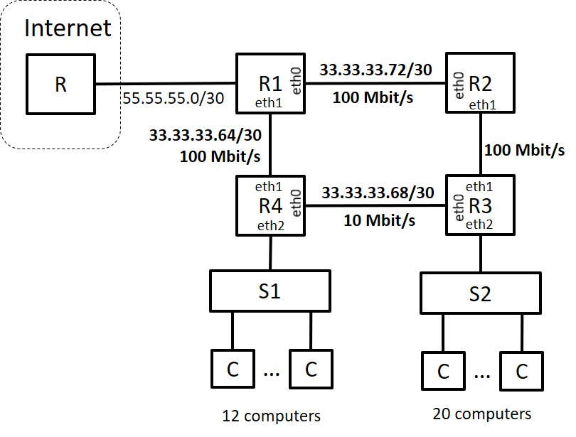

## Resource 2020/21

### Question 1

A network consisting of interconnected Ethernet switches defining a unique spanning tree is

- a. a packet-switched network and offers a connection-oriented service.
- b. a packet-switched network and offers a connectionless service. :heavy_check_mark:
- c. I DO NOT ANSWER THIS QUESTION.
- d. a circuit-switched network and offers a connection-oriented service.
- e. a circuit-switched network and offers a connectionless service.

**Justification:** A network of Ethernet switches exchanges packets and is connectionless.

### Question 2

If a signal s(t)=Ai cos(θi + 2π fc t) is used to transmit information, Ai∈{1/2,1}, θi∈{0,π} and the baudrate is fc/10 baud, then the bitrate enabled by this modulation is

- a. fc/5 bit/s. :heavy_check_mark:
- b. fc/10 bit/s.
- c. I DO NOT ANSWER THIS QUESTION.
- d. fc∗4 bit/s.
- e. fc/10∗4 bit/s.

**Justification:** M = 2\*2 = 4; by Hartley's law, C=2B log2(M) = baudrate \* log2(M) = fc/10 \* log2(4) = fc/10 \* 2 = fc/5 bit/s

### Question 3

When Byte stuffing is used, if the following sequence of characters is required to be transmitted A|ESC|FLAG|B then, the suffing mechanism will generate the following sequence of bytes:

- a. A|ESC|ESC|FLAG|B :heavy_check_mark:
- b. A|B
- c. A|FLAG|FLAG|B
- d. I DO NOT ANSWER THIS QUESTION.
- e. A|ESC|ESC|ESC|FLAG|B

### Question 4

Consider a Selective Repeat ARQ mechanism using 2 bits for numbering frames. The transmitter behaviour is described in a notation where, for instance, !I(0).?RR(1).SW represents the transmission (!) of frame I(0) followed (.) by the reception (?) of frame RR(1), followed (.) by a stop and wait (SW). Assuming the transmitter always has frames to transmit, after the occurence of !I(0).?RR(1)!I(1), the transmitter behaviour can be characterised by

- a. !I(2).!I(3).SW
- b. !I(0).SW
- c. !I(2).SW :heavy_check_mark:
- d. I DO NOT ANSWER THIS QUESTION.
- e. SW

**Justification:**

k = 2  
M = 2^k = 2^2 = 4

Selective Repeat: W = M/2 = 2

### Question 5

Assume that a computer's eth0 network interface is modelable by a stable G/G/1 queue, characterized by an average arrival rate of α packet/s and an average capacity of β packet/s. If the average number of packets in the network interface is N and the traffic intensity is ρ, then the average time T that a packet remains on the network interface is:

- a. N/α :heavy_check_mark:
- b. I DO NOT ANSWER THIS QUESTION.
- c. N/β
- d. ρ/β
- e. ρ/α

### Question 6

When a frame is received by an Ethernet Switch and the forwarding table does not contain an entry for the frame's destination address, the Switch

a. Invokes a Reverse Address Resolution Protocol (RARP) procedure.
b. Discards the frame.
c. I DO NOT ANSWER THIS QUESTION.
d. forwards the frame based on its destination IP address.
e. Sends the frame through all the ports except the port through which the frame was received. :heavy_check_mark:

### Question 7

Assume the following connections scenario  
`[A]--0[SW]1--0[RT]1--[B]`  
In this scenario, computer A is connected to port 0 of the Ethernet switch SW, port 1 of the switch SW is connected to port 0 of the router RT, and computer B is connected directly to port 1 of the router RT. In this situation, when computer A sends an ARP-Request so that it can communicate with computer B, the destination MAC address of the ARP-Request frame is

- a. MAC address of B.
- b. A MAC broadcast adress. :heavy_check_mark:
- c. I DO NOT ANSWER THIS QUESTION.
- d. MAC address of RT.porta0.
- e. MAC address of SW.port0

### Question 8

A router's forwarding table consists of entries in the format `<networkAddress/mask, outputPort>` and contains the following entries `{<150.33.128.0/17, 1>, <150.33.126.0/24, 2>}`. If to this router arrives a packet having the destination address 150.33.127.1, then the packet will be

a. discarded. :heavy_check_mark:
b. forwarded to port 2.
c. forwarded to port 1.
d. I DO NOT ANSWER THIS QUESTION.
e. forwarded to all the output ports except the incoming port.

### Question 9

In the process of transferring a file using the FTP protocol in passive mode, the opening of the control connection is done

- a. by the client to a port indicated by the server.
- b. I DO NOT ANSWER THIS QUESTION.
- c. by the server to port 21.
- d. by the client to port 21. :heavy_check_mark:
- e. by the server to a port indicated by the client.

### Question 10

The Spanning Tree Protocol used on Ethernet networks

a. Allows each switch to be aware of the congestion level of neighbouring switches.
b. Allows each switch to determine its shortest path tree for the other switches in the network.
c. I DO NOT ANSWER THIS QUESTION.
d. Allows a single tree to be calculated, rooted in the node with the lowest identifier. :heavy_check_mark:
e. Allows a single tree to be calculated, rooted in the first node to start the algorithm.

### Question 11

Two stations communicate using a Stop and Wait ARQ mechanism. The propagation delay (in one direction) is 5 ms, the information frames have a fixed size of 104104 bits and the acknowledgment frames have a negligible size. Let us assume BER=0.

If a maximum throughput (débito) of 500 kbit/s is observed, the capacity of this link is

C=**1000** kbit/s.

### Question 12

Assume that the above link has a capacity of 2 Mbit/s, the same propagation delay of 5 ms, the same frame size of 10⁴ bit and a Bit Error Ratio BER=10^-5. If the Selective Repeat ARQ mechanism is adopted, then the maximum efficiency possible for this link would be

S=**90**%

### Question 13

Assuming that the efficiency of above question is S=80%, then the minimum number of bits required to number the frames would be

k=**3** bits.

**Justification:**

Tprop = 5 ms = 0.005 s  
C = 2 Mbit/s  
Smax = 0.8  
BER = 10^-5

Smax = 1-pe
pe = 1-(1-BER)^L <=> (1-BER)^L = 1-pe <=> (1-BER)^L = Smax <=>
<=> L = ln(Smax)/ln(1-BER) = 22314.24 bit

Say L = 22314 bit.

Tf = L/C = 0.011157 s

a = Tprop/Tf = 0.448149144

W = 1+2a = 1.896298288

Say W = 2; M = 4, k=2

### Question 14

A transmission system is modeled by a M/M/1 queue. An average bitrate of 9 Mbit/s arrives to the system in packets having an average length of 1500 Bytes. The transmission line is empty 25% of the time. In these conditions, the average transmission time of a packet is

Ts=**1000** μs.

### Question 15

Let us assume a constant packet lenght of 104104 bits and a transmission capacity of 10 Mbit/s. If we aim to limit the maximum delay experienced by a packet in this queue to T=5ms, then we should assign to
this queue the amount of memory required to store at most

B = **5** packets.

### Question 16

Let us assume a constant packet lenght of 10⁴ bits, a transmission capacity of 10 Mbit/s, an infinite buffer capacity and an inter-arrival time interval of packets to the queue characterised by a generic probability distribution function. If the average number of packets waiting this queue is Nw=4 packets and the average waiting time of a packet in the queue is Tw=5 ms, then the average bitrate arriving to this queue is

arrival bitrate = **8** Mbit/s.

### Question 17

Company A was assigned the IP address block 33.33.33.64/26. The company has a communications network with the architecture described in the figure, consisting of 4 routers (R1, R2, R3, R4) and two Ethernet switches (S1 and S2). Switch S1 serves 12 computers. Switch S2 serves 20 computers. Routers are connected by point-to-point links and to some of these links are assigned the network addresses shown in the figure. The address of the network consisting of 12 computers, using the address/mask format (for example 33.33.33.128/30), is

**33.33.33.80/28**

**Justification:**

|       |                   |
|-------|-------------------|
| R1-R2 | 33.33.33.010010?? |
| R1-R4 | 33.33.33.010000?? |
| R3-R4 | 33.33.33.010001?? |

|     | IP              |
|-----|-----------------|
| 20C | 33.33.33.96/27  |
| 12C | 33.33.33.80/28  |
| R23 | 33.33.33.76/30  |

### Question 18

The broadcast address of the network consisting of 12 computers is

**33.33.33.95**

### Question 19

The IP address of network interface R3.eth1 is (use the lowest address possible and do not indicate the mask)

**33.33.33.77**

### Question 20

Considering that (1) the cost of a link is the inverse of its capacity, and (2) packets should use minimum cost paths, the default gateway of router R3 should be router

a. R1.
b. R4.
c. R2. :heavy_check_mark:
